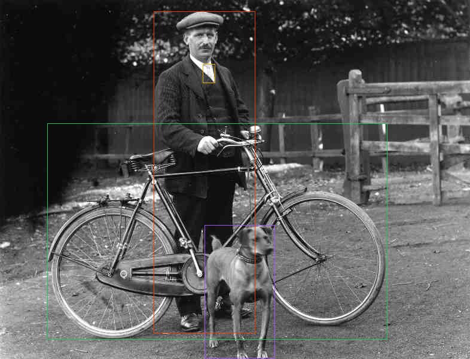

# boquilens

Object detection in pure Rust, powered by [Burn](https://burn.dev). The full inference path—model
graph, preprocessing, decoding, and post-processing—runs natively in Rust with no Python, PyTorch,
or ONNX Runtime.



## Models

Every model runs **object detection** on COCO-80 classes; YOLOX Nano/Tiny use their official
416 px input and the remaining detectors use 640 px. The YOLO11-seg,
YOLOv8-seg, and YOLO26-seg variants add **instance segmentation**, and the YOLO26-cls, YOLO11-cls,
and YOLOv8-cls variants run
**image classification** on ImageNet-1k at 224 px. Default builds expose **Predict**. The
non-default `training` feature adds experimental native WGPU `train`, `val`, and training-checkpoint
`export` commands. Every pretrained family uses a one-time `pack-weights` conversion into
boquilens' native Burnpack format; normal inference consumes `.bpk` only.

| Model    | Status       | Task                        | Modes   | Variants                     | Weights                          |
| -------- | ------------ | --------------------------- | ------- | ---------------------------- | -------------------------------- |
| YOLOX    | stable       | Detect                      | Predict | nano, tiny, s, m, l, x       | one-time `.bpk` pack             |
| YOLOv3   | experimental | Detect                      | Predict | tiny-u                       | one-time `.bpk` pack             |
| YOLOv10  | experimental | Detect                      | Predict | n, s, m, b, l, x             | one-time `.bpk` pack             |
| YOLO11   | experimental | Detect, Segment, Classify   | Predict | n, s, m, l, x (+n..x -seg/-cls) | one-time `.bpk` pack         |
| YOLOv8   | experimental | Detect, Segment, Classify   | Predict | n, s, m, l, x (+n..x -seg/-cls) | one-time `.bpk` pack         |
| YOLO12   | experimental | Detect                      | Predict | n, s, m, l, x                | one-time `.bpk` pack             |
| YOLO26   | experimental | Detect, Segment, Classify   | Predict | n, s, m, l, x (+n..x -seg/-cls) | one-time `.bpk` pack          |

Variant naming follows each family (YOLOX scales as nano/tiny/s/m/l/x, v3 ships a tiny model, and
the modern families use n/s/m/l/x; YOLOv10 replaces the xl scale with b). Pass the variant-suffixed
CLI name: `yolox-nano`, `yolox-tiny`, `yolox-s`, `yolox-m`, `yolox-l`, `yolox-x`, `yolov3-tinyu`,
`yolov10n`, ..., `yolo11n`, ..., `yolo11n-seg`, ..., `yolo26x`, `yolo26n-seg`, ..., `yolo26n-cls`, ...,
`yolov8n`, ..., `yolov8n-seg`, ..., `yolov8n-cls`, ..., `yolo12n`, ..., `yolo11n-cls`, ..., `yolo26x-cls`.
YOLOX Burnpacks are converted from the official Apache-2.0 checkpoints.
Ultralytics-family weights are AGPL-3.0, and the native artifacts derived from them inherit that
license (see [NOTICE](NOTICE)). YOLOX Nano and Tiny run at their official 416 px resolution; other
detect models run at 640 px.

The native trainer accepts Ultralytics-style dataset YAML and uses deterministic augmentation,
padded targets, differentiable family-specific criteria, accumulation, selective decay, and
full-fp32 model/optimizer/EMA checkpoints with epoch-boundary resume. Every model/task row above is
wired for training: YOLOX/YOLOv3/YOLOv8/YOLOv10/YOLO11/YOLO12/YOLO26 detection, the v8/v11/v26
segmenters, and the v8/v11/v26 classifiers. Detection and segmentation accept YOLO or COCO
manifests (including crowd-aware validation); classification uses class folders.

`--weights` initializes from an official tensor-only checkpoint. Equal-class imports are strict;
when the dataset class count changes, only the documented class-output projections remain freshly
initialized. `--resume` instead restores the exact full-precision model, optimizer, EMA, schedule,
progress, dataset identity, and class table, and is mutually exclusive with `--weights`. Validation
reports source-space AP50/AP50--95 for boxes and masks or top-1/top-5 for classification. Export
uses EMA weights, removes training-only branches, embeds the ordered custom class table and input
size, and smoke-reloads the resulting Burnpack through the public `Predictor`.

Use an optimized build for actual training; unoptimized model graphs are prohibitively slow:

```console
cargo run --locked --release --features training -- train --model yolo26n --data dataset.yaml --weights target/yolo26n-state.pt --epochs 100
cargo run --locked --release --features training -- val --checkpoint runs/detect/train-.../checkpoints/last --json
cargo run --locked --release --features training -- export --checkpoint runs/detect/train-.../checkpoints/last --output target/custom-yolo26n.bpk
cargo run --locked --release -- predict --model yolo26n --weights target/custom-yolo26n.bpk --source image.jpg
```

Training remains experimental until the external one-step fixtures, tiny-overfit proofs, and
COCO8/COCO8-seg/ImageNet-small quality reports are complete on the maintained GPU.

See [AUGMENTATION_COMPATIBILITY.md](AUGMENTATION_COMPATIBILITY.md) for augmentation parity and
[TRAINING_IMPLEMENTATION_PLAN.md](TRAINING_IMPLEMENTATION_PLAN.md) for the remaining release gates.

## ONNX export

The default build includes an offline `export-onnx` bridge. Rust first loads the requested
checkpoint into the exact boquilens architecture and snapshots those loaded parameters to
SafeTensors. A pinned, repository-owned Python adapter then reconstructs the matching reference
graph, loads every inference tensor strictly, exports ONNX, runs the ONNX checker and strict shape
inference, executes the graph with ONNX Runtime CPU, compares deterministic inputs, and publishes
the ONNX file plus `<model>.onnx.json` sidecar atomically. Python is needed only to produce the
artifact; consuming the result does not require Python, PyTorch, Burn, or boquilens.

Create the dedicated environment explicitly (the command never installs packages or downloads a
model):

```powershell
python -m venv target/.venv
target/.venv/Scripts/python.exe -m pip install -r tools/onnx/requirements.lock.txt
```

Ultralytics-family export requires the pinned sibling checkout at `../ultralytics`, revision
`461196cf09175b64c9b9bd8babebf081c0540520`. YOLOX requires the official `0.1.1rc0` checkout at
`target/yolox-ref/YOLOX-0.1.1rc0` or `--yolox-repo`. Source paths and package versions are checked
before loading the model; a floating installed `ultralytics` wheel is not used.

```powershell
cargo run --locked --release -- export-onnx `
  --model yolo26n `
  --weights target/yolo26n-coco-ultralytics-v8.4-boquilens-v1.bpk `
  --output target/yolo26n.onnx
```

The required portable profile takes float32 RGB NCHW tensors and leaves confidence filtering,
NMS/top-k policy, source-image coordinate reversal, and mask assembly outside the graph. Use
`--profile ultralytics` for the pinned Ultralytics-compatible packed layout. Fixed FP32 is the
validated baseline; dynamic axes, FP16, and the separate `end2end` profile fail clearly until
their own parity gates land. The sidecar is the normative input/output, preprocessing,
postprocessing, validation, hash, and license contract. Exporting a checkpoint does not change the
license of its architecture or weights; see [NOTICE](NOTICE). `--no-verify` omits only the extra
exact-Burn comparison; checker, strict shape inference, and ONNX Runtime execution remain mandatory.

YOLOX, YOLOv3, YOLO11, YOLOv8, and YOLO12 pass through shared classic class-aware non-maximum
suppression; YOLOv10 and YOLO26 use NMS-free end-to-end selection. YOLOv8's head keeps the
legacy full-3x3-conv classification towers while YOLO11/YOLO12 use the light DWConv flavor, and
YOLO12 adds the area-attention `A2C2f` backbone/neck stages (l/x carry a learnable gamma residual).
The YOLO11-seg and YOLOv8-seg models share that NMS
path and add Ultralytics' Segment head: 32 mask prototypes at stride 4 plus per-detection mask
coefficients; instance masks are returned as boolean coverage over the source image. The YOLO26-seg
models ride the end-to-end path instead (top-score selection, no NMS) and add Ultralytics'
`Segment26` head, whose `Proto26` module fuses all three feature levels into the stride-4
prototypes; mask assembly is identical to YOLO11-seg. The YOLO26-cls, YOLO11-cls, and YOLOv8-cls
models run at 224 px
(Ultralytics' classify default) and return top-5 ImageNet-1k classes; the classification
checkpoints carry plain PyTorch batch-norm defaults rather than the Ultralytics-initialized values
(see AGENTS.md).

Verified v1 artifacts:

| Model        | Bytes       | SHA-256                                                            |
| ------------ | ----------: | ------------------------------------------------------------------ |
| yolov3-tinyu |  24,411,296 | `52AD28C04D234F500387E9C874A52447F6A107490968BF9A23C653DDCB14DBBA` |
| yolov10n     |   4,779,424 | `8A672F4924F52E89F7DF95C689C66CF157A96674CE1ADF3C2CF6A025D5C9C44B` |
| yolov10s     |  14,822,560 | `6E6427357A25CFA6FE96D5BA0130808B16A699B0E282EF37A80366497BAC351F` |
| yolov10m     |  31,221,920 | `65C579B005413714F8E935316EA84FE12B689049621A9B15ED6EFF64B536F84C` |
| yolov10b     |  38,692,768 | `15EB91359D74E3A48D98356CF0410D9566B20AE70705C940A17C29078C73B906` |
| yolov10l     |  49,446,304 | `D0412F77DDE5E9ED53324687551FDF29AEF6F34387B9EBC838322891CA90C260` |
| yolov10x     |  59,978,400 | `B47954C6647A8298C2A0444CA53EEB2E498A4D4B52FDB14A934A4FD2AB6A39C2` |
| yolo26n      |   5,016,992 | `5FB09D89850E2ECB75C0580893239DEF9BB130E95A228FB319675F267B5B24C6` |
| yolo26s      |  19,283,872 | `DD287F71998783596CBF5204F29D589D215EBF910987623CBCB1DD8F0AD91855` |
| yolo26m      |  41,216,928 | `50A0BE494BA93D5663084161999B3D2B2C9ABB6DABB163D0AED2DB6F37591249` |
| yolo26l      |  50,140,064 | `19D2C802F3266571FC7298DB9C3AB0E912D4DD6004B1D37510124F92A428A171` |
| yolo26x      | 112,210,080 | `D1B1B94FC28423CC4FFD4EA04DEEAE3FE4A352B7E0D8F442D6CE9FA616C813A9` |
| yolo26n-seg  |   5,664,064 | `4AB2E714E0684C10E09D3F226BF810C0D8D67D0985440DA3221634A2A7AB4FEE` |
| yolo26s-seg  |  21,107,520 | `C2DD24C137EC530823D3651C23C4CE71E945DDA0B327E50FA668F2144593FDB4` |
| yolo26m-seg  |  47,565,120 | `7EB2FE79189782273B11682C42A479FF4691384DAC1F0A980FA2D1139F32FE55` |
| yolo26l-seg  |  56,488,000 | `188217E220DE61F12BDEF62DF35C24FB5FF836B75420CE2A4617CDACF27233F0` |
| yolo26x-seg  | 126,443,072 | `0575D2EE7AAED7A69566D6A9302D2DAB9CDA9D3C0ED7E36B14484A46B0AF3407` |
| yolo11n      |   5,399,968 | `36ACCB9BCEF72CD1DD3D534F54BE845C9EE4EE1697AD65C731FE028028E68BDF` |
| yolo11s      |  19,140,768 | `4277237339A0975D1E86FBFB7787D861982F9B64B857C458E0D998671AA63DB9` |
| yolo11m      |  40,561,568 | `ACFE957B42A17D81C9988772E2A1576592B3DB293DC8D52AFC91BCECB5595073` |
| yolo11l      |  51,208,352 | `84FE90D17143FB894CEFE6557D3619F000E1602BDC331905FE56E6AC996F953F` |
| yolo11x      | 114,597,280 | `1AC48B4A48165632F7B54A7B2E8471C9FB782CE436DE795C3155BCEF848C156E` |
| yolo11n-cls  |   5,712,080 | `201E942BE72E2B7C9738E8FC47FA2CD6A6C53882D74FFC4A9128D241D6900EC8` |
| yolo11s-cls  |  13,576,144 | `F80D6920F963D27730F7B1162D279BD540A44CEBB3F75AB7177E5EF98812E6DE` |
| yolo11m-cls  |  23,434,960 | `2606D5C0C0BA54BD3B0B698D2D6A869F149910D2DB5FEB00345141D0D4D956BD` |
| yolo11l-cls  |  28,472,528 | `81D741BD9AD8102EAAA6D2E97FC28C1C590C9027AB68B4A2363D6CF91B16B26B` |
| yolo11x-cls  |  59,609,552 | `BBFC0F7BF0FAF65367BA5F47643F27E7D53AA50F73DE30FEA08CFCD709C86A52` |
| yolo11n-seg  |   5,919,808 | `A29FF611095F39E3875A22B03B93DC1FDCD5AE40A1310AA5DF4D3813E17B1FF4` |
| yolo11s-seg  |  20,465,216 | `FD9841F96748BD32A50EF508340F86A161B331D44F3D16678A96BED1A76342BE` |
| yolo11m-seg  |  45,191,744 | `5B74DC2C1C32197837173C298A48CD9ABC351B4D9763BF7DB4300DBA144DE3BB` |
| yolo11l-seg  |  55,838,528 | `BC956ED901F0922760CF9D7B5534377C2383B76A2953180C03CD0D707FDDD6C3` |
| yolo11x-seg  | 124,976,448 | `B1B816DEF3920992491CF7EFAB9638EFAC69B2896F0CDAF64FB4546FDCFDC070` |
| yolov8n      |   6,418,080 | `420607A592E014754B1994AD96065E996A87A3F258A0226CE271E35B2A1895C6` |
| yolov8s      |  22,483,360 | `BDFD4C0DF3BB699425E4F7D85AB593088C4FED1E3842835F41F5233BA484E77F` |
| yolov8m      |  52,056,224 | `8457C821CBE154DE426CA91033F8F9913C8C3FA06391525BF30274D80427E036` |
| yolov8l      |  87,710,112 | `C8F8FC496B3EEE137151D71D4ECCFD1C8A376201DCFB09FAE4C2B6B62E82C4BA` |
| yolov8x      | 136,876,704 | `66F8954A2ED7CE6BB5CBD81A2212E4CF902AA616CD5CB4A52C2A8673A32EDE2B` |
| yolov8n-seg  |   6,937,408 | `E5D3A2619A0F6E6E711CFFBFEED54F91B407038369CD53DE84CF6E23D30EB5CA` |
| yolov8s-seg  |  23,807,808 | `A193580E817752E73B45684305E447739B3A647BC2B423C86EC8D29B597771BF` |
| yolov8m-seg  |  54,839,360 | `8B5ED4197DDA3A2AADEE88CDBCF53BB32E0F3F994EB5EB2BFF4C7F5A0FA3A6AB` |
| yolov8l-seg  |  92,340,288 | `969CCBF1F3F1058B2B95ABF78DA089DEC16C2D7A4021AA76CD2E38F3207F3E6E` |
| yolov8x-seg  | 144,098,368 | `69F24863F62769150AA6642671A63F4A6D278372F458FA83ED7E86FFFBCC5503` |
| yolov8n-cls  |   5,498,064 | `9D8729A22CEF3F7BB6CC584D80DC6A0C61758F4AA39376C79E0B06D8ADF56F65` |
| yolov8s-cls  |  12,804,048 | `AC89B1D489E1BFF31D86C6D831875699ED4D86B97F483ABF3C08041EC4B89205` |
| yolov8m-cls  |  34,248,400 | `01FFB857B35FAD528E9CA0F777BC78C690720861277A15541B2B4DB247AADAAB` |
| yolov8l-cls  |  75,167,952 | `DE3D3B45536EE3C85119B0B594D3129B49238809C377582D90891265E4EF14E8` |
| yolov8x-cls  | 115,106,768 | `1B5BF48CF1D710B7E2A967E2A898236BE098475357E4E6C1F686B32D89D5D197` |
| yolo12n      |   5,426,592 | `65A44ECCF690942511DFEB8BB98173F0FEB45A3BA6C9A2730FCEF8424D4E928C` |
| yolo12s      |  18,901,920 | `60B596F8B8E2ACB5AC93B35773BD7CC05FF751DA52B098DF97E8392EA37D4D96` |
| yolo12m      |  40,860,064 | `DE851D8778A4FB1E7167571ED0F164C99A31757A58C968D91AB3DB6A07A0309E` |
| yolo12l      |  53,627,808 | `654B28CEC86CA060E8011EBE263398C06D1DCEF5D653007EC34C087BBF37C998` |
| yolo12x      | 119,476,896 | `3F64AAE14F3E509B79B4F7C242DC994F3027FEA7E3B0C9D2317B4711C1994CBB` |
| yolo26n-cls  |   5,712,080 | `5A0BC57C4EA137DBB3E52FC2AB7007023474E10401C00BF6B1D857C2E053FB18` |
| yolo26s-cls  |  13,576,144 | `F39B0D7A9FC65495D8D7944BFA7AE9F32C1F6D719AB15043DE40E962FCC811BB` |
| yolo26m-cls  |  23,434,960 | `301F3351F301C5BDEE5A8FC8A54CFF602245BDFA1A64794E61737803FCB684A0` |
| yolo26l-cls  |  28,472,528 | `C759F229D8863D5F78D67FF714A7F1C5AE826417AC7BD906FE08F208DC88AA12` |
| yolo26x-cls  |  59,609,552 | `8468915AA906623DC82E4AEF086C7DC1C236B5E09E30CA849DC03399BF059165` |

### Model coverage vs the Ultralytics catalog

The matrix below enumerates the Ultralytics model catalog of the v8.4.0 assets release (checkpoint
availability verified by HTTP against the release, 2026-08-28) and what boquilens implements.
Status: **landed** (verified parity + tests), **planned** (checkpoint exists, bring-up pending),
**deferred** (possible but out of budget, with reason), or **unavailable** (no official checkpoint
in the release).

| Family  | Task   | Checkpoints in v8.4.0        | boquilens status                              |
| ------- | ------ | ---------------------------- | --------------------------------------------- |
| YOLOX   | detect | n/tiny/s/m/l/x (`.pth`)      | landed: n/tiny/s/m/l/x                        |
| YOLOv3  | detect | u, tiny-u, spp-u             | landed: tiny-u                                 |
| YOLOv5  | detect | u-variants n/s/m/l/x (+p6)   | deferred (older architecture; budget)          |
| YOLOv6  | detect | none in release              | unavailable                                    |
| YOLOv8  | detect | n/s/m/l/x                    | landed: n/s/m/l/x                              |
| YOLOv8  | seg    | n/s/m/l/x                    | landed: n/s/m/l/x                              |
| YOLOv8  | cls    | n/s/m/l/x                    | landed: n/s/m/l/x                              |
| YOLOv8  | p2     | none in release              | unavailable                                    |
| YOLOv9  | detect | t/s/m/c/e                    | deferred (new blocks + aux branches; budget)   |
| YOLOv10 | detect | n/s/m/b/l/x                  | landed: n/s/m/b/l/x                            |
| YOLO11  | detect | n/s/m/l/x                    | landed: n/s/m/l/x                              |
| YOLO11  | seg    | n/s/m/l/x                    | landed: n/s/m/l/x                              |
| YOLO11  | cls    | n/s/m/l/x                    | landed: n/s/m/l/x                              |
| YOLO12  | detect | n/s/m/l/x                    | landed: n/s/m/l/x                              |
| YOLO12  | seg/cls | none in release             | unavailable                                    |
| YOLO26  | detect | n/s/m/l/x                    | landed: n/s/m/l/x                              |
| YOLO26  | seg    | n/s/m/l/x                    | landed: n/s/m/l/x                              |
| YOLO26  | cls    | n/s/m/l/x                    | landed: n/s/m/l/x                              |
| RT-DETR | detect | l, x (resnet50 absent)       | deferred (transformer decoder; separate bring-up) |
| YOLOE   | detect/seg | YAML-only (no COCO `.pt`) | unavailable                                   |

Pose and oriented-box (OBB) checkpoints exist in the release for several families but are
**deferred by owner decision (2026-08)**: not planned for development, and intentionally absent
from the matrix above.

Bring-up order (owner priority: newest first, task-type reuse preferred): YOLO26 cls/seg
(landed) → YOLO12 detect (landed) → YOLO11 seg m/l/x (landed) → YOLOv8 detect/seg/cls (landed) →
YOLOv9. Task-type result APIs (`Classification`, `SegmentationDetection`) are shared across the
families that use the same decode path.

### Preparing weights

YOLOX checkpoints can be packed directly from the official `.pth` release:

```console
cargo run --release -- pack-weights --model yolox-nano --input target/yolox_nano.pth --output target/yolox-nano-coco-official-v0.1.1rc0-boquilens-v1.bpk
```

Ultralytics checkpoints first need a tensor-only state (Python is a conversion-time dependency
only); substitute the model name for `yolov3-tinyu`, `yolov10n/s/m/b/l/x`, `yolo11n/s/m/l/x`,
`yolo11n/s/m/l/x-seg`, `yolo11n/s/m/l/x-cls`, `yolov8n/s/m/l/x`, `yolov8n/s/m/l/x-seg`,
`yolov8n/s/m/l/x-cls`, `yolo12n/s/m/l/x`, `yolo26n/s/m/l/x`, `yolo26n/s/m/l/x-seg`, or
`yolo26n/s/m/l/x-cls`:

```console
python -m pip install torch ultralytics
python -c "from ultralytics import YOLO; YOLO('yolo26m.pt')"
python tools/export_ultralytics_state.py yolo26m.pt target/yolo26m-state.pt
cargo run --release -- pack-weights --model yolo26m --input target/yolo26m-state.pt --output target/yolo26m-coco-ultralytics-v8.4-boquilens-v1.bpk
```

After that, inference only needs the `.bpk` artifact and Rust.

## Usage

```console
cargo run --release -- predict --model yolox-nano --weights target/yolox-nano-coco-official-v0.1.1rc0-boquilens-v1.bpk --source assets/dog_bike_man.jpg
cargo run --release -- predict --model yolo26n --weights target/yolo26n-coco-ultralytics-v8.4-boquilens-v1.bpk --source image.jpg --json --confidence 0.30
cargo run --release -- predict --model yolo11n-seg --weights target/yolo11n-seg-coco-ultralytics-v8.4-boquilens-v1.bpk --source image.jpg --masks
cargo run --release -- predict --model yolov8n-seg --weights target/yolov8n-seg-coco-ultralytics-v8.4-boquilens-v1.bpk --source image.jpg --masks
cargo run --release -- predict --model yolo12n --weights target/yolo12n-coco-ultralytics-v8.4-boquilens-v1.bpk --source image.jpg
cargo run --release -- predict --model yolo26s-cls --weights target/yolo26s-cls-imagenet1k-ultralytics-v8.4-boquilens-v1.bpk --source image.jpg --json
cargo run --release -- predict --model yolov8s-cls --weights target/yolov8s-cls-imagenet1k-ultralytics-v8.4-boquilens-v1.bpk --source image.jpg --json
cargo run -- --help
```

Detections are printed as a table or JSON and an annotated PNG is written next to the input
(`--output` overrides). Boxes are unnormalized, continuous `XYXY` pixel edges in the original
source image, clipped to its bounds and sorted by confidence; the JSON output carries matching
coordinate metadata. Segmentation models accept `--masks` to stroke the instance-mask outlines on
the annotated image and report per-detection covered-pixel counts (JSON gains a mask summary; the
full bitmask is available through the Rust API).

### Rust API

```rust,no_run
use boquilens::{ModelId, PredictOptions, Predictor};
use burn_flex::Flex;

fn main() -> boquilens::Result<()> {
    let predictor = Predictor::<Flex>::from_checkpoint(
        ModelId::YoloxX,
        "target/yolox-x-coco-official-v0.1.1rc0-boquilens-v1.bpk",
        PredictOptions::default(),
    )?;
    let (_image, detections) = predictor.predict_path("image.jpg")?;
    for detection in detections {
        println!("{}: {:.1}%", detection.class_name, detection.confidence * 100.0);
    }
    Ok(())
}
```

Instance segmentation is available for the YOLO11-seg, YOLOv8-seg, and YOLO26-seg variants through
`Predictor::predict_segmentation` / `predict_segmentation_path`, which return
`SegmentationDetection` values: the same box fields as `Detection` plus a boolean source-image
coverage mask (`InstanceMask`, `width * height` bytes):

```rust,no_run
use boquilens::{ModelId, PredictOptions, Predictor};
use burn_flex::Flex;

fn main() -> boquilens::Result<()> {
    let predictor = Predictor::<Flex>::from_checkpoint(
        ModelId::Yolo11NSeg,
        "target/yolo11n-seg-coco-ultralytics-v8.4-boquilens-v1.bpk",
        PredictOptions::default(),
    )?;
    let (_image, detections) = predictor.predict_segmentation_path("image.jpg")?;
    for detection in detections {
        let covered = detection.mask.data.iter().filter(|pixel| **pixel).count();
        println!("{}: {:.1}% mask_px={}", detection.class_name, detection.confidence * 100.0, covered);
    }
    Ok(())
}
```

Image classification is available for the YOLO26-cls, YOLO11-cls, and YOLOv8-cls variants through
`Predictor::predict_classification` / `predict_classification_path`, which return top-5
`Classification` values (ImageNet-1k class id/name and softmax probability, descending). The
input transform mirrors Ultralytics' classify inference exactly: anti-aliased shortest-edge resize
to 224 px, centered 224x224 crop, RGB scaled to `[0, 1]`:

```rust,no_run
use boquilens::{ModelId, PredictOptions, Predictor};
use burn_flex::Flex;

fn main() -> boquilens::Result<()> {
    let predictor = Predictor::<Flex>::from_checkpoint(
        ModelId::Yolo26SCls,
        "target/yolo26s-cls-imagenet1k-ultralytics-v8.4-boquilens-v1.bpk",
        PredictOptions::default(),
    )?;
    let (_image, classifications) = predictor.predict_classification_path("image.jpg")?;
    for classification in classifications {
        println!("{}: {:.1}%", classification.class_name, classification.confidence * 100.0);
    }
    Ok(())
}
```

## Performance

Single-image, batch-1 inference: model forward, head decode, and result sync, on Burn's Flex CPU
backend in release mode. YOLOX Nano/Tiny run at 416 px, other detect/segment rows at 640 px, and
the `-cls` classification rows at 224 px (each model's official inference resolution). Artifacts
store f16 weights that are upcast and computed in f32. Each number is the median of 10 timed runs
after 3 warmup runs,
measured sequentially (one test at a time) via:

```console
cargo test --locked --release measures_single_inference_latency -- --ignored --nocapture --test-threads 1
```

The Ultralytics column is the official PyTorch runtime on the same machine and methodology
(batch 1, matching per-family input size, fp32 CPU, fused conv+bn, 16 torch threads, 3 warmups +
10 timed runs), measured with the development-only tool:

```console
& target\.venv\Scripts\python.exe tools\bench_ultralytics_cpu.py target\yolov10n.pt ...
```

The GPU column runs the same harness on Burn's Wgpu backend (built with `--features gpu`), on an
NVIDIA GeForce RTX 5080 selected through Vulkan (driver 610.47), f16 artifacts computed in f32:

```console
cargo test --locked --release --features gpu measures_single_inference_latency_gpu -- --ignored --nocapture --test-threads 1
```

Reference machine: AMD Ryzen 9 9950X3D (16C/32T), 32 GB RAM, Windows 11. Absolute numbers move with
hardware and library releases; treat them as a relative scale across variants, not a benchmark claim.
YOLOX scale rows are not measured yet: the latency harness lives with the per-scale model tests that
the Ultralytics families have and YOLOX does not.

Methodology audit and alternative-CPU-backend measurements (Flex `x86-v4`, the `burn-cpu` CubeCL
backend, rayon thread scaling, and the full product-path comparison against `ultralytics predict`)
live in [PERF_NOTES.md](PERF_NOTES.md); the `cpu-simd` and `cpu-cubecl` features exist purely to
reproduce those measurements and do not change the default build.

| Model    | boquilens CPU (ms) | boquilens GPU (ms) | GPU vs CPU | Ultralytics PyTorch CPU (ms) |
| -------- | -----------------: | -----------------: | ---------: | ---------------------------: |
| yolov10n |              129.1 |               10.6 |      12.2x |                         19.0 |
| yolov10s |              241.0 |               19.8 |      12.2x |                         32.1 |
| yolov10m |              454.7 |               43.5 |      10.5x |                         62.8 |
| yolov10b |              594.0 |               64.1 |       9.3x |                         88.4 |
| yolov10l |              735.7 |               86.9 |       8.5x |                        122.2 |
| yolov10x |              939.6 |               94.8 |       9.9x |                        169.8 |
| yolo26n  |              116.2 |                9.3 |      12.5x |                         22.5 |
| yolo26s  |              237.1 |               21.0 |      11.3x |                         42.9 |
| yolo26m  |              478.0 |               53.5 |       8.9x |                         85.2 |
| yolo26l  |              619.3 |               66.1 |       9.4x |                        109.7 |
| yolo26x  |              975.2 |              124.8 |       7.8x |                        196.8 |
| yolo11n  |              130.1 |                8.5 |      15.3x |                         17.8 |
| yolo11s  |              243.8 |               17.3 |      14.1x |                         31.7 |
| yolo11m  |              486.7 |               45.6 |      10.7x |                         68.9 |
| yolo11l  |              634.6 |               56.5 |      11.2x |                         92.8 |
| yolo11x  |              991.6 |              115.6 |       8.6x |                        179.1 |
| yolo11n-seg |            173.9 |               13.5 |      12.9x |                         22.8 |
| yolo11s-seg |            307.4 |               29.9 |      10.3x |                         44.8 |
| yolo26n-cls |               10.6 |              4.2 |      2.5x |                         2.6 |
| yolo26s-cls |               24.6 |              5.3 |      4.6x |                         4.5 |
| yolo26m-cls |               52.6 |              9.6 |      5.5x |                         8.2 |
| yolo26l-cls |               70.6 |             13.4 |      5.3x |                        11.8 |
| yolo26x-cls |              106.0 |             18.3 |      5.8x |                        19.0 |
| yolo11n-cls |                9.3 |              3.8 |      2.4x |                         3.1 |
| yolo11s-cls |               23.7 |              4.4 |      5.4x |                         4.1 |
| yolo11m-cls |               47.9 |              7.5 |      6.4x |                         8.9 |
| yolo11l-cls |               65.6 |             23.2 |      2.8x |                        11.7 |
| yolo11x-cls |              102.3 |             15.5 |      6.6x |                        21.2 |
| yolo26n-seg |              160.3 |              9.5 |     16.9x |                        24.1 |
| yolo26s-seg |              314.5 |             28.5 |     11.0x |                        44.0 |
| yolo26m-seg |              651.4 |             85.8 |      7.6x |                       106.6 |
| yolo26l-seg |              794.1 |             96.4 |      8.2x |                       128.5 |
| yolo26x-seg |             1251.9 |            229.6 |      5.5x |                       233.1 |

- **CPU.** The CPU columns are the always-available path: Burn's Flex backend. Preprocessing and
  top-k postprocessing are not included and add a small constant per image. Flex currently trails
  fused PyTorch CPU inference by roughly 5-7.5x; closing that gap (kernel fusion, threading) is CPU
  engineering work on top of Burn, independent of the model graphs.
- **GPU.** The `gpu` feature (burn-wgpu over Vulkan/DX12 on Windows and Linux, Metal on macOS)
  enables `--device gpu` in the CLI and the GPU latency tests above. Detections are numerically
  identical to the CPU path on the reference image (f32 compute on both). The first GPU forward
  compiles kernels and autotunes, so cold start is much slower than steady state; the harness
  excludes it via warmup runs.

## Development

```console
cargo fmt --check
cargo test --locked
cargo clippy --locked --all-targets -- -D warnings
cargo check --locked --no-default-features --lib
```

Golden parity fixtures are generated per model against the official checkpoints and consumed by the
ignored tests (the fixture exporters cover every detect and seg scale via `--model`). YOLOX uses its
own exporter, which runs the official YOLOX PyTorch sources instead of the Ultralytics package:

```console
python tools/export_yolo26_fixtures.py target/yolo26m.pt assets/dog_bike_man.jpg target --model yolo26m
cargo test --locked yolo26m -- --ignored

python tools/export_yolo11_fixtures.py target/yolo11n.pt assets/dog_bike_man.jpg target --model yolo11n
cargo test --locked yolo11n -- --ignored

python tools/export_yolo11_fixtures.py target/yolo11n-seg.pt assets/dog_bike_man.jpg target --model yolo11n-seg
cargo test --locked yolo11n-seg -- --ignored

python tools/export_yolov8_fixtures.py target/yolov8n.pt assets/dog_bike_man.jpg target --model yolov8n
cargo test --locked yolov8n -- --ignored

python tools/export_yolov8_fixtures.py target/yolov8n-seg.pt assets/dog_bike_man.jpg target --model yolov8n-seg
cargo test --locked yolov8n_seg -- --ignored

python tools/export_yolo12_fixtures.py target/yolo12n.pt assets/dog_bike_man.jpg target --model yolo12n
cargo test --locked yolo12n -- --ignored

python tools/export_yolo26_cls_fixtures.py target/yolo26s-cls.pt assets/dog_bike_man.jpg target --model yolo26s-cls
cargo test --locked yolo26s_cls -- --ignored

python tools/export_yolo26_cls_fixtures.py target/yolo11n-cls.pt assets/dog_bike_man.jpg target --model yolo11n-cls
cargo test --locked yolo11n_cls -- --ignored

python tools/export_yolov8_cls_fixtures.py target/yolov8n-cls.pt assets/dog_bike_man.jpg target --model yolov8n-cls
cargo test --locked yolov8n_cls -- --ignored

python tools/export_yolo26_seg_fixtures.py target/yolo26n-seg.pt assets/dog_bike_man.jpg target --model yolo26n-seg
cargo test --locked yolo26n_seg -- --ignored

python tools/export_yolo26_seg_e2e.py target/yolo26n-seg.pt assets/dog_bike_man.jpg target --model yolo26n-seg
cargo test --locked yolo26n_seg_matches_ultralytics_end_to_end -- --ignored --nocapture

& target\.venv\Scripts\python.exe tools\export_yolox_fixtures.py target\checkpoints\yolox_tiny.pth assets\dog_bike_man.jpg target --model yolox-tiny
cargo test --locked yolox_tiny -- --ignored
```

The segmentation variants additionally compare the full runtime end to end against the official
Ultralytics predict (boxes plus per-detection mask IoU in source-image space); their expectation is
generated with:

```console
python tools/export_yolo11_seg_e2e.py target/yolo11n-seg.pt assets/dog_bike_man.jpg target --model yolo11n-seg
cargo test --locked yolo11n_seg_matches_ultralytics_end_to_end -- --ignored --nocapture
```

The YOLOv8-seg and YOLO26-seg variants use the same shared tooling (`export_yolov8_fixtures.py`
plus `export_yolo11_seg_e2e.py`, and `export_yolo26_seg_fixtures.py` plus
`export_yolo26_seg_e2e.py` respectively) with their own `--model` ids.

See [AGENTS.md](AGENTS.md) for the full model-porting workflow and invariants.

## License

boquilens is [AGPL-3.0](LICENSE). The YOLOX path derives from Apache-2.0 code
([LICENSE-APACHE](LICENSE-APACHE)) and uses official Apache-2.0 weights; Ultralytics architectures
and checkpoints are AGPL-3.0. Full provenance in [NOTICE](NOTICE).
