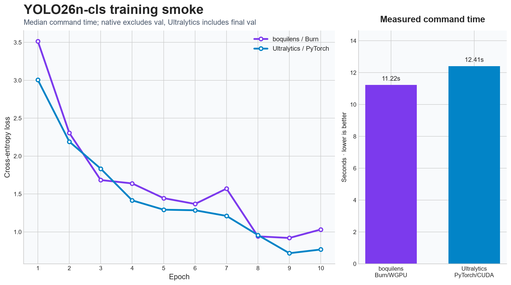

# boquilens

Object detection, instance segmentation, and image classification in Rust with
[Burn](https://burn.dev).

Inference is native Rust: model execution, preprocessing, decoding, and postprocessing do not
require Python, PyTorch, or ONNX Runtime.


## Quick start

Every model runs from a boquilens Burnpack (`.bpk`). Upstream `.pth` and `.pt` checkpoints are
one-time conversion inputs; they are not accepted by `predict`.

### 1. Prepare weights

For YOLOX, download a checkpoint from the
[official release](https://github.com/Megvii-BaseDetection/YOLOX/releases/tag/0.1.1rc0) and pack it
directly:

```console
cargo run --locked --release -- pack-weights --model yolox-nano --input target/yolox_nano.pth --output target/yolox-nano-coco-official-v0.1.1rc0-boquilens-v1.bpk
```

For Ultralytics models, first export a tensor-only state, then pack it:

```console
python -m pip install torch ultralytics==8.4.117
python -c "from ultralytics import YOLO; YOLO('yolo26n.pt')"
python tools/export_ultralytics_state.py yolo26n.pt target/yolo26n-state.pt
cargo run --locked --release -- pack-weights --model yolo26n --input target/yolo26n-state.pt --output target/yolo26n-coco-ultralytics-v8.4-boquilens-v1.bpk
```

Python is needed only for the Ultralytics conversion step.

### 2. Run inference

```console
cargo run --locked --release -- predict --model yolo26n --weights target/yolo26n-coco-ultralytics-v8.4-boquilens-v1.bpk --source assets/dog_bike_man.jpg
```

Detection and segmentation commands print results and write an annotated PNG. Classification
commands print the top five classes. Useful options:

```console
--json                 Print machine-readable output
--confidence 0.30      Set the confidence threshold
--output result.png    Choose the annotated-image path
--device gpu           Use WGPU; build with --features gpu
--masks                Render masks for a -seg model
```

## Supported models

| Model | Variants | Tasks |
| --- | --- | --- |
| YOLOX | `nano, tiny, s, m, l, x` | Detect |
| YOLOv3 | `tinyu` | Detect |
| YOLOv8 | `n, s, m, l, x` | Detect, segment, classify |
| YOLOv10 | `n, s, m, b, l, x` | Detect |
| YOLO11 | `n, s, m, l, x` | Detect, segment, classify |
| YOLO12 | `n, s, m, l, x` | Detect |
| YOLO26 | `n, s, m, l, x` | Detect, segment, classify |

YOLOX is stable. All other model families are experimental.

Detect and segment models use COCO-80 classes. Classification models use ImageNet-1k and return
the top five classes. YOLOX Nano/Tiny use 416 px inputs, classifiers use 224 px, and the remaining
models use 640 px.

Task examples:

```console
# Detection
cargo run --locked --release -- predict --model yolox-nano --weights target/yolox-nano-coco-official-v0.1.1rc0-boquilens-v1.bpk --source image.jpg

# Instance segmentation
cargo run --locked --release -- predict --model yolo11n-seg --weights target/yolo11n-seg-coco-ultralytics-v8.4-boquilens-v1.bpk --source image.jpg --masks

# Classification
cargo run --locked --release -- predict --model yolo26s-cls --weights target/yolo26s-cls-imagenet1k-ultralytics-v8.4-boquilens-v1.bpk --source image.jpg --json
```

## Rust API

```rust,no_run
use boquilens::{ModelId, PredictOptions, Predictor};
use burn_flex::Flex;

fn main() -> boquilens::Result<()> {
    let predictor = Predictor::<Flex>::from_checkpoint(
        ModelId::Yolo26N,
        "target/yolo26n-coco-ultralytics-v8.4-boquilens-v1.bpk",
        PredictOptions::default(),
    )?;

    let (_image, detections) = predictor.predict_path("image.jpg")?;
    for detection in detections {
        println!("{}: {:.1}%", detection.class_name, detection.confidence * 100.0);
    }
    Ok(())
}
```

Use `predict_segmentation_path` for `-seg` models and `predict_classification_path` for `-cls`
models.

Detection boxes are source-image `XYXY` pixel edges. Segmentation results add a boolean mask in
source-image coordinates.

## GPU

Build with the `gpu` feature and select the device at runtime:

```console
cargo run --locked --release --features gpu -- predict --model yolo26n --device gpu --weights target/yolo26n-coco-ultralytics-v8.4-boquilens-v1.bpk --source image.jpg
```

The default CPU backend is Burn Flex. Benchmark methodology and recorded CPU/GPU results live in
[PERF_NOTES.md](PERF_NOTES.md).

## ONNX export

ONNX export is an offline development workflow. Create its pinned Python environment once:

```powershell
python -m venv target/.venv
target/.venv/Scripts/python.exe -m pip install -r tools/onnx/requirements.lock.txt
```

Then export a Burnpack:

```powershell
cargo run --locked --release -- export-onnx `
  --model yolo26n `
  --weights target/yolo26n-coco-ultralytics-v8.4-boquilens-v1.bpk `
  --output target/yolo26n.onnx
```

The exporter validates the graph with ONNX Runtime and writes an `.onnx.json` contract beside the
model. Source checkout requirements and validation details are in
[tools/onnx/README.md](tools/onnx/README.md).

## Training

Native training is experimental, WGPU-only, and disabled by default. Always use a release build:

```console
cargo run --locked --release --features training -- train --model yolo26n --data dataset.yaml --weights target/yolo26n-state.pt --epochs 100
cargo run --locked --release --features training -- val --checkpoint runs/detect/train-.../checkpoints/last --json
cargo run --locked --release --features training -- export --checkpoint runs/detect/train-.../checkpoints/last --output target/custom-yolo26n.bpk
```

Training, validation, resume, and export workflows are implemented and smoke-tested. Convergence
and reference-quality parity are not yet established.

The comparison below uses YOLO26n-cls, the same pretrained checkpoint, 10 epochs, batch 2, 224 px,
FP32, AdamW, and the same 12-image ImageNet-10 subset on an RTX 5080. Five warm-cache boquilens
runs took 9.02–11.31 s (median 11.22 s); three Ultralytics runs took 12.16–14.05 s (median 12.41 s).
Ultralytics includes final validation while boquilens validation ran separately, so these are not
directly comparable throughput measurements.
With persistent compilation caching disabled, the same native command took 29.30 s. Enabling it
stores reusable kernels under `target/vulkan` (2.8 MB after this classification run). The tiny
dataset exposes overhead, not model quality; scheduler stepping and augmentation RNG also differ.



The median-time native checkpoint reached 50.0% vs 16.7% top-1 accuracy and 66.7% vs 58.3% top-5
on the 12-image validation split. One image changes accuracy by 8.3 points, so these values are not
a quality conclusion. boquilens retains full resumable epoch checkpoints, while `last` and `best`
reuse their immutable payloads instead of writing duplicates.

The supported augmentation contract is documented in
[AUGMENTATION_COMPATIBILITY.md](AUGMENTATION_COMPATIBILITY.md).

## Development

```console
cargo fmt --check
cargo test --locked
cargo clippy --locked --all-targets -- -D warnings
cargo check --locked --no-default-features --lib
```

Model bring-up, ignored parity tests, fixture generation, and implementation invariants are in
[MODEL_BRINGUP.md](MODEL_BRINGUP.md) and [AGENTS.md](AGENTS.md).

## License

boquilens is [AGPL-3.0](LICENSE). YOLOX code and official weights are Apache-2.0; see
[LICENSE-APACHE](LICENSE-APACHE). Ultralytics architectures and checkpoints are AGPL-3.0. Full
provenance is recorded in [NOTICE](NOTICE).
