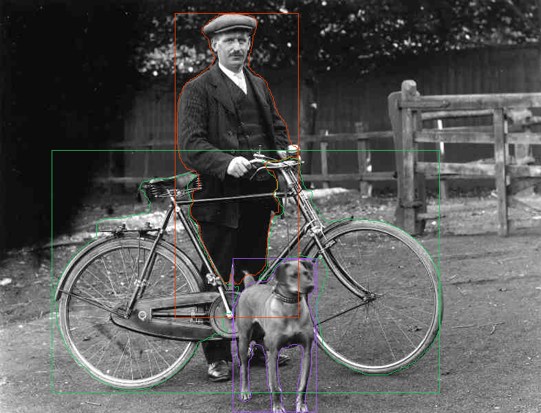

<div align="center">

<picture>
  
</picture>

Native object detection, instance segmentation, and image classification in Rust with [Burn](https://burn.dev).

<h3>

[Performance](https://github.com/boquila/montgomery/blob/main/docs/performance-comparison.MD) | [Model support](#supported-models)

</h3>

[](https://github.com/boquila/montgomery/actions/workflows/ci.yml)
[](LICENSE)

</div>

---

Montgomery is a native Rust computer-vision stack:

- YOLO inference on CPU or GPU
- WGPU training with validation, resumable checkpoints, and ready-to-use exports
- Detection, instance segmentation, and classification
- Burnpack and ONNX export

Normal inference needs no Python, PyTorch, or ONNX Runtime.



## Quick start

Download the compiled `montgomery` binary for your platform from
[Releases](https://github.com/boquila/montgomery/releases). To convert an upstream checkpoint,
install [uv](https://docs.astral.sh/uv/) and run:

```console
uv run --project tools python -c "from ultralytics import YOLO; YOLO('yolo26n.pt')"
uv run --project tools tools/export_ultralytics_state.py yolo26n.pt target/yolo26n-state.pt
montgomery pack-weights --model yolo26n --input target/yolo26n-state.pt
```

This creates `yolo26n.bpk`. Architecture, dataset, upstream version, format version, and licensing
stay inside the artifact metadata. Run inference with the same short model name:

```console
montgomery predict --model yolo26n --source image.jpg
```

Useful options: `--json`, `--confidence 0.30`, `--output result.png`, `--masks`, and `--device gpu`.
Pass `--weights another-name.bpk` only when you deliberately use a nonstandard filename.

YOLOX accepts its official `.pth` directly through `pack-weights`. Other families use the
tensor-only conversion shown above. Prediction always uses a Montgomery `.bpk` Burnpack.

## Supported models

| Model | Variants | Tasks |
| --- | --- | --- |
| YOLOX | `nano, tiny, s, m, l, x` | Detect |
| YOLOv3 | `tinyu` | Detect |
| YOLOv8 | `n, s, m, l, x` | Detect, segment, classify |
| YOLOv10 | `n, s, m, b, l, x` | Detect |
| YOLO11 | `n, s, m, l, x` | Detect, segment, classify |
| YOLO12 | `n, s, m, l, x` | Detect |
| YOLO26 | `n, s, m, l, x` | Detect, segment, classify |

YOLOX is stable. The other families and native training are experimental.

## Rust API

```rust,no_run
use montgomery::Model;

fn main() -> montgomery::Result<()> {
    let model = Model::new("yolo26n.bpk")?;

    let prediction = model.inference("image.jpg")?;
    for detection in prediction.detections().expect("detection model") {
        println!("{}: {:.1}%", detection.class_name, detection.confidence * 100.0);
    }
    Ok(())
}
```

## Train

```console
montgomery train --model yolo26n --data dataset.yaml --epochs 100
```

Every run contains:

- `results.csv`, `results.svg`, and `validation.jsonl`
- `exports/best.bpk` and `exports/last.bpk`
- `checkpoints/best` and `checkpoints/last`

Only the best and latest resumable models are retained.
Use `--save-period` to control recovery checkpoints and `--workers` to override automatic CPU
worker selection.

Montgomery won 22 of 30 matched short training benchmarks against Ultralytics on an RTX 5080.
Classification and small batched workloads are strongest; batch-1, 640 px, medium segmentation,
and longer detection/segmentation runs still need work. Full methodology and limitations are in the
[performance report](docs/performance-comparison.MD). Full-dataset quality parity is not yet claimed.

## Export ONNX

```console
montgomery export-onnx --model yolo26n
```

This reads `yolo26n.bpk` and writes `yolo26n.onnx`; use `--weights` or `--output` only to override
those names.

The offline exporter validates the graph with ONNX Runtime. Setup details are in
[tools/onnx/README.md](tools/onnx/README.md).

## Develop

Stable Rust is the only requirement to start development

```console
git clone https://github.com/boquila/montgomery.git && cd montgomery
cargo test
```

The same checks used by CI are:

```console
cargo fmt --check
cargo test
cargo clippy --all-targets -- -D warnings
cargo check --no-default-features --lib
```

See [docs/MODEL_BRINGUP.md](docs/MODEL_BRINGUP.md) for new model families.

## License

Montgomery is [AGPL-3.0](LICENSE).
