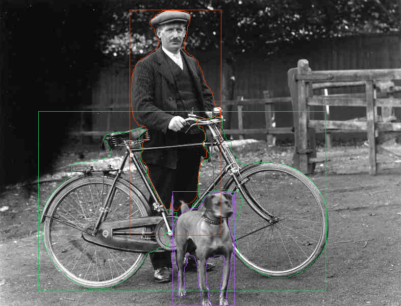
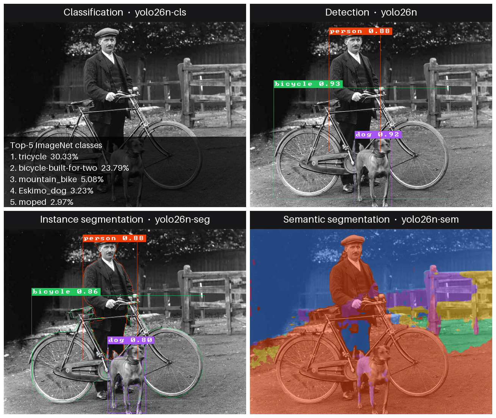

<div align="center">

<picture>
  
</picture>

Native object detection, instance segmentation, semantic segmentation, depth estimation, and image classification in Rust with [Burn](https://burn.dev)

<h3>

[Performance](https://github.com/boquila/montgomery/blob/main/docs/performance-comparison.MD) | [Model support](#supported-models)

</h3>

[](https://github.com/boquila/montgomery/actions/workflows/ci.yml)
[](LICENSE)

</div>

---

Montgomery is an experimental Rust computer-vision stack:

- Computer vision inference on CPU or GPU
- WGPU training with validation, resumable checkpoints, and ready-to-use exports
- Detection, instance segmentation, semantic segmentation, depth estimation, and classification
- Burnpack and ONNX export

Normal inference needs no Python, PyTorch, or ONNX Runtime.



## Supported models

| Model | Variants | Tasks |
| --- | --- | --- |
| YOLOX | `nano, tiny, s, m, l, x` | Detect |
| YOLOv3 | `tinyu` | Detect |
| YOLOv8 | `n, s, m, l, x` | Detect, segment, classify |
| YOLOv10 | `n, s, m, b, l, x` | Detect |
| YOLO11 | `n, s, m, l, x` | Detect, segment, classify |
| YOLO12 | `n, s, m, l, x` | Detect |
| YOLO26 | `n, s, m, l, x` | Detect, segment, semantic, depth, classify |

## Rust API

```rust,no_run
use montgomery::Model;

fn main() -> montgomery::Result<()> {
    let model = Model::new("yolo26n.bpk")?;

    let prediction = model.inference("image.jpg")?;
    for detection in prediction.detections().expect("detection model") {
        println!("{}: {:.1}%", detection.class_name, detection.confidence * 100.0);
    }
    Ok(())
}
```

## Inference

```console
montgomery predict --model best.bpk --source image.jpg --json
```

Benchmark cold-start and steady-state inference without loading an image:

```console
montgomery bench --device gpu --model best.bpk
```

## Train

```console
# Fresh initialization
montgomery train --architecture yolo26n --data dataset.yaml --epochs 100

# Pretrained initialization
montgomery train --model yolo26n.bpk --data dataset.yaml --epochs 100

# Automatically choose a hardware-specific batch size
montgomery train --model yolo26n.bpk --data dataset.yaml --batch -1 --epochs 100

# Exact continuation (model and dataset come from the training checkpoint)
montgomery train --resume runs/detect/train-<timestamp>-<pid>/checkpoints/last
```

Exactly one initialization mode is required: `--architecture` means scratch, `--model` requires a
pretrained `.bpk`, and `--resume` requires a full native training checkpoint. A Burnpack initializes
a new run; it is not a resumable optimizer checkpoint.

Every run contains:

- `results.csv`, `results.svg`, and `validation.jsonl`
- `exports/best.bpk` and `exports/last.bpk`
- `checkpoints/best` and `checkpoints/last`

Only the best and latest resumable models are retained.
Use `--save-period` to control recovery checkpoints and `--workers` to override automatic CPU
worker selection.
`--batch -1` runs isolated WGPU optimizer-step probes, finds the largest fitting microbatch up to
the training-set size (capped at 1024), and uses 80% of that verified maximum for runtime headroom.

## Validation

```console
montgomery val --model best.bpk --data dataset.yaml
```

Reports task-appropriate metrics for the dataset's validation split. Use `--json` for structured
output, or `--checkpoint checkpoints/best` to validate a resumable training checkpoint.

## Export ONNX

```console
montgomery export --model yolo26n.bpk --format onnx
```

This reads the explicit Burnpack and writes `yolo26n.onnx`; use `--output` to select another path.

The offline exporter validates the graph with ONNX Runtime. Setup details are in
[tools/onnx/README.md](tools/onnx/README.md).

## Develop

Stable Rust is the only requirement to start development

```console
git clone https://github.com/boquila/montgomery.git && cd montgomery
cargo test
```

Before you open a pull request, run the quick checks:

```console
cargo fmt --check
cargo clippy --all-targets -- -D warnings
cargo test
```

Changes to training or augmentation also need these:

```console
cargo clippy --features training --all-targets -- -D warnings
cargo test --features training --lib
```

CI runs the full set, including the minimal-library Clippy pass and the slow every-scale model
tests.

See [docs/MODEL_BRINGUP.md](docs/MODEL_BRINGUP.md) for new model families.

## All five tasks on one image

Same `docs/dog_bike_man.jpg` through the YOLO26n family: classification top-5,
detection boxes, per-object instance masks, the dense semantic map, and the depth map
in meters.



## License

Montgomery is [AGPL-3.0](LICENSE).
