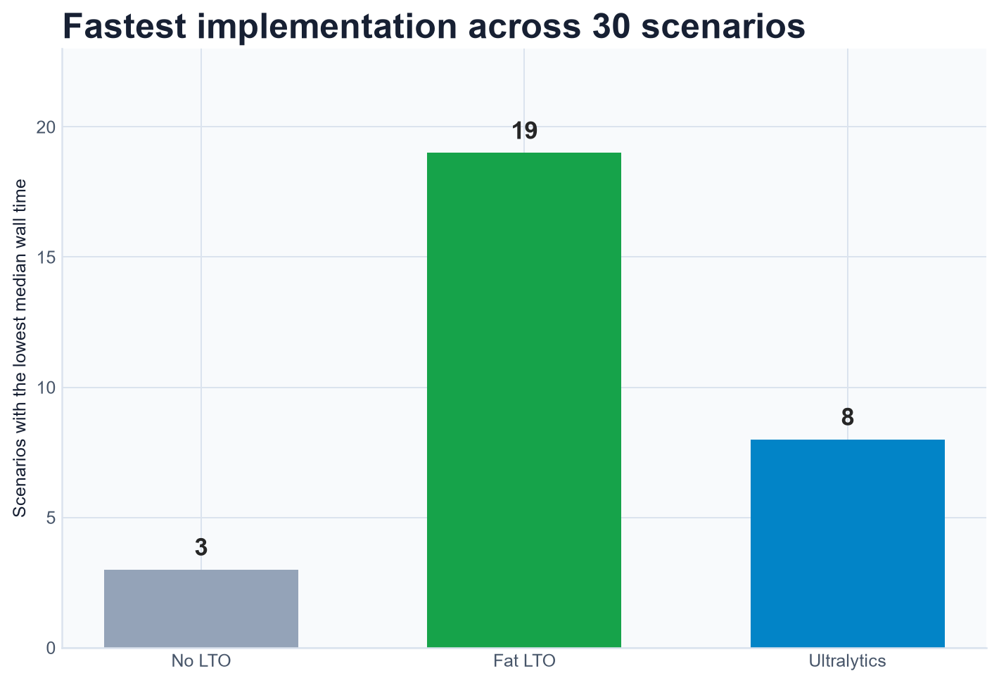
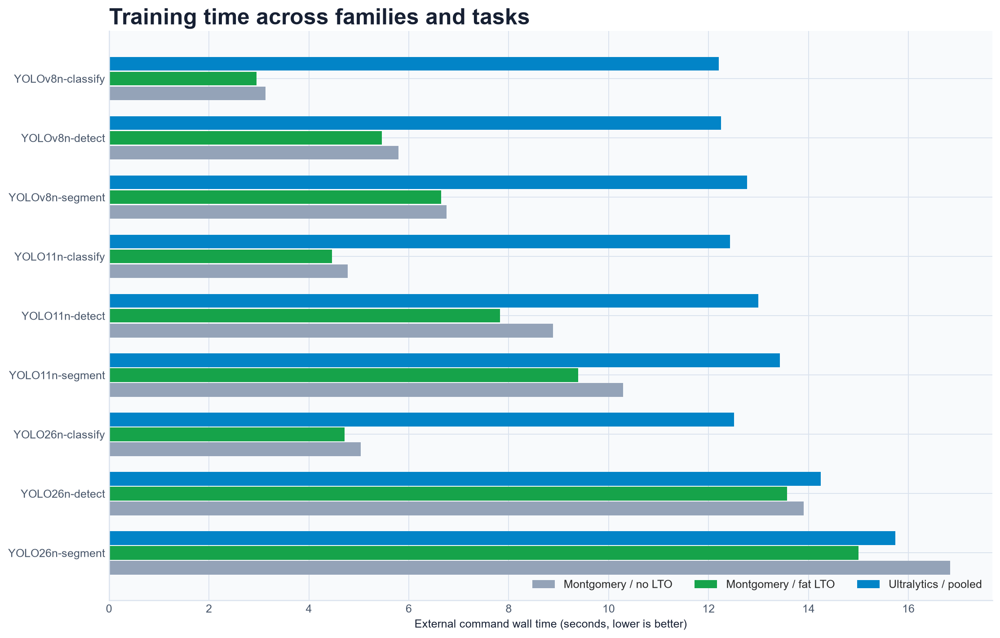
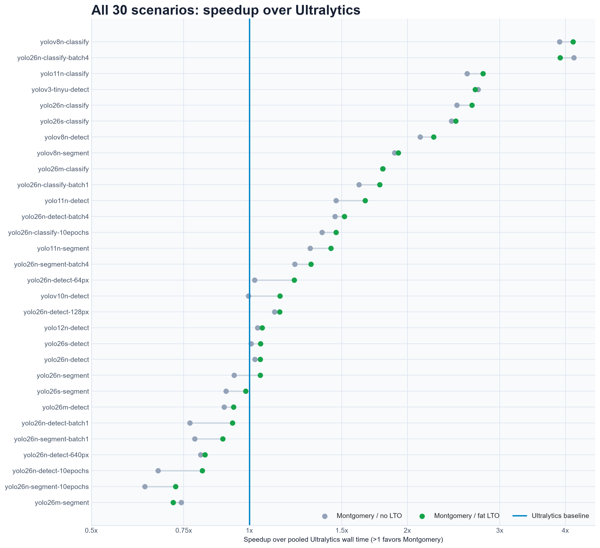
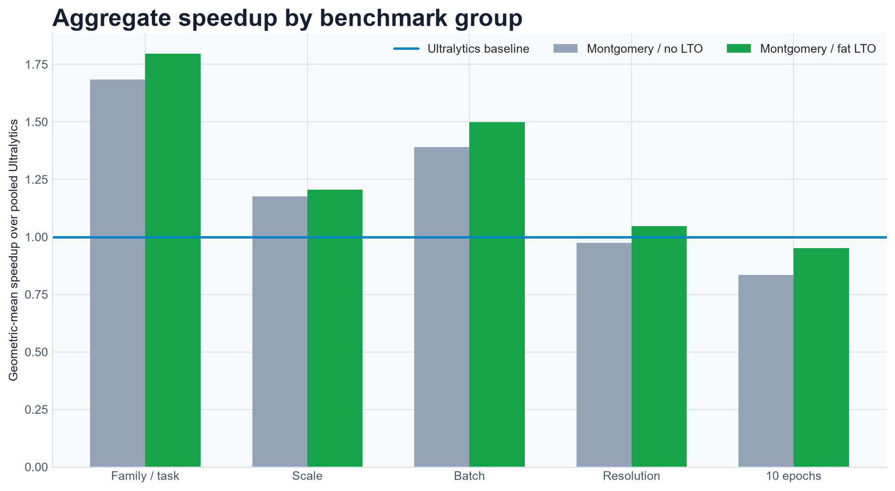
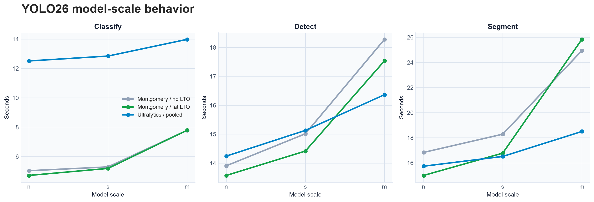
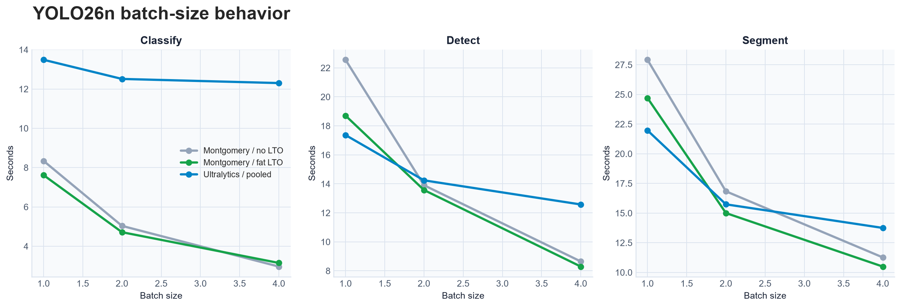
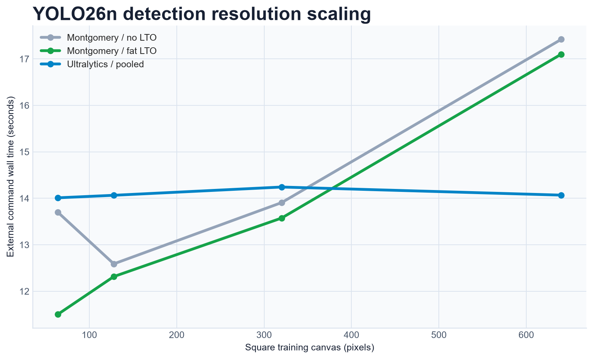
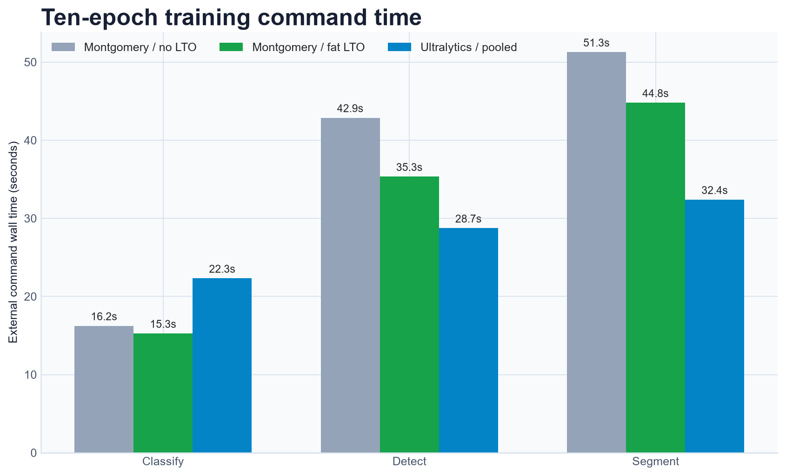
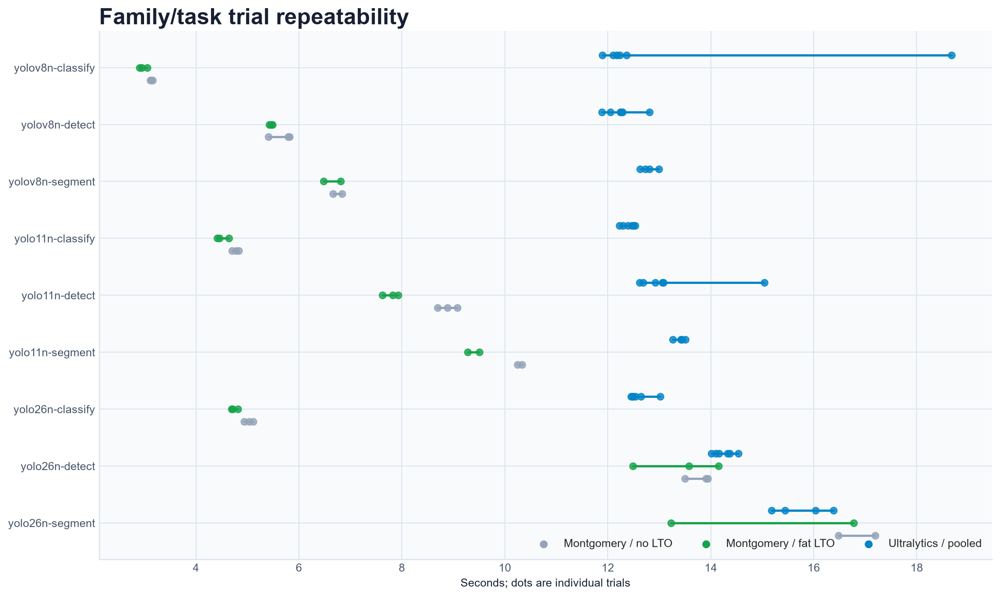

# No LTO vs fat LTO vs Ultralytics

This report compares three training implementations directly:

- Montgomery built without link-time optimization;
- Montgomery built with `[profile.release] lto = "fat"`;
- Ultralytics 8.4.117 on PyTorch CUDA 13.0.

Both Montgomery binaries were built from commit
`9d415df6a7e8fafe2dcbc045de0938b066537783`. The Ultralytics series pools the identical paired
trials from both benchmark sessions and takes their median: six samples normally and four for
segmentation scenarios. This produces one more stable Ultralytics reference without mixing in the
older published benchmark revision.

## At a glance



| Measurement | Montgomery, no LTO | Montgomery, fat LTO | Ultralytics, pooled |
| --- | ---: | ---: | ---: |
| Scenarios with lowest median | 3 of 30 | **19 of 30** | 8 of 30 |
| Sum of 30 scenario medians | 432.316 s | **396.396 s** | 468.479 s |
| Geometric-mean speedup over Ultralytics | 1.331x | **1.422x** | 1.000x |
| Native executable size | 116,947,456 bytes | **108,098,048 bytes** | Not comparable |

Fat LTO reduces Montgomery's geometric-mean native wall time by **6.4%** relative to no LTO and
reduces the executable by **7.6%**. Against the pooled Ultralytics reference, Montgomery's
geometric-mean advantage increases from 1.331x without LTO to 1.422x with fat LTO.

The sum of scenario medians is descriptive rather than a workload-weighted score: the matrix
intentionally repeats the YOLO26n baseline across scale, batch, and resolution sweeps and includes
longer ten-epoch cells.

## Family and task comparison



Across the 12 family/task cells, geometric-mean speedup over Ultralytics is **1.683x without LTO**
and **1.796x with fat LTO**. Fat LTO is fastest in 10 of these 12 cells. No LTO narrowly wins
YOLOv3-Tiny-U detection, while pooled Ultralytics narrowly wins YOLO26s segmentation.

## Every measured scenario



The blue `1x` line is pooled Ultralytics. Points to its right favor Montgomery; points to its left
favor Ultralytics. The gray-to-green connector shows how enabling fat LTO moves each Montgomery
scenario.

Fat LTO most clearly improves host- and synchronization-heavy jobs, including YOLO26n detection at
batch 1, 64-pixel detection, and the longer detect/segment runs. Ultralytics remains fastest for
the larger or less well-amortized YOLO26 detection/segmentation cells.

## Aggregate behavior



| Benchmark group | No-LTO speedup | Fat-LTO speedup | Fastest aggregate |
| --- | ---: | ---: | --- |
| Family and task | 1.683x | **1.796x** | Fat LTO |
| YOLO26 scale | 1.175x | **1.205x** | Fat LTO |
| Batch size | 1.390x | **1.499x** | Fat LTO |
| Input resolution | 0.974x | **1.046x** | Fat LTO |
| Ten-epoch convergence | 0.835x | **0.951x** | Ultralytics |

Values are geometric-mean speedups over pooled Ultralytics. Values above `1x` favor Montgomery.
Fat LTO moves the resolution group from slightly behind to slightly ahead, but Ultralytics retains
the aggregate lead in the deliberately small ten-epoch convergence runs.

## Scale, batch, and resolution



At medium scale, Ultralytics leads YOLO26 detection and segmentation. Montgomery remains clearly
ahead for classification, and fat LTO gives modest improvements in the small/medium detection
cells.



Montgomery dominates classification at every tested batch size and detect/segment at batch 4.
Ultralytics leads batch-1 detection and segmentation. Fat LTO materially narrows both batch-1 gaps.



Fat LTO makes Montgomery fastest through 320 pixels in this sweep. Ultralytics remains fastest at
640 pixels, where GPU compute is a larger fraction of the small command's wall time.

## Ten-epoch commands



Fat LTO is fastest for classification. It reduces Montgomery's detection median from 42.9 to 35.3
seconds and segmentation from 51.3 to 44.8 seconds, but pooled Ultralytics remains faster at 28.7
and 32.4 seconds respectively.

## All 30 medians

Bold values are the lowest median wall time in each row.

| Scenario | No LTO | Fat LTO | Ultralytics, pooled |
| --- | ---: | ---: | ---: |
| YOLOv8n classify | 3.131 s | **2.952 s** | 12.206 s |
| YOLOv8n detect | 5.794 s | **5.458 s** | 12.251 s |
| YOLOv8n segment | 6.752 s | **6.644 s** | 12.769 s |
| YOLO11n classify | 4.781 s | **4.459 s** | 12.427 s |
| YOLO11n detect | 8.882 s | **7.822 s** | 12.992 s |
| YOLO11n segment | 10.289 s | **9.392 s** | 13.430 s |
| YOLO26n classify | 5.035 s | **4.713 s** | 12.512 s |
| YOLO26n detect | 13.907 s | **13.575 s** | 14.243 s |
| YOLO26n segment | 16.836 s | **15.003 s** | 15.738 s |
| YOLOv3-Tiny-U detect | **4.378 s** | 4.435 s | 11.947 s |
| YOLOv10n detect | 13.732 s | **11.949 s** | 13.667 s |
| YOLO12n detect | 13.425 s | **13.165 s** | 13.918 s |
| YOLO26s classify | 5.294 s | **5.192 s** | 12.845 s |
| YOLO26s detect | 15.015 s | **14.416 s** | 15.132 s |
| YOLO26s segment | 18.289 s | 16.778 s | **16.515 s** |
| YOLO26m classify | **7.786 s** | 7.793 s | 13.984 s |
| YOLO26m detect | 18.280 s | 17.539 s | **16.367 s** |
| YOLO26m segment | 24.940 s | 25.840 s | **18.504 s** |
| YOLO26n classify, batch 1 | 8.342 s | **7.618 s** | 13.487 s |
| YOLO26n classify, batch 4 | **2.964 s** | 3.148 s | 12.302 s |
| YOLO26n detect, batch 1 | 22.559 s | 18.708 s | **17.367 s** |
| YOLO26n detect, batch 4 | 8.644 s | **8.294 s** | 12.578 s |
| YOLO26n segment, batch 1 | 27.922 s | 24.703 s | **21.972 s** |
| YOLO26n segment, batch 4 | 11.264 s | **10.492 s** | 13.749 s |
| YOLO26n detect, 64 px | 13.700 s | **11.503 s** | 14.011 s |
| YOLO26n detect, 128 px | 12.589 s | **12.316 s** | 14.065 s |
| YOLO26n detect, 640 px | 17.421 s | 17.102 s | **14.069 s** |
| YOLO26n classify, 10 epochs | 16.231 s | **15.258 s** | 22.311 s |
| YOLO26n detect, 10 epochs | 42.869 s | 35.338 s | **28.733 s** |
| YOLO26n segment, 10 epochs | 51.262 s | 44.791 s | **32.386 s** |

## Trial repeatability



The Ultralytics series contains both sessions' samples, which exposes session variation directly.
For example, the YOLOv8n classification range includes one high Ultralytics outlier, while the
pooled median remains close to the other five samples. Eighteen native scenario ranges are fully
non-overlapping in favor of fat LTO; none are fully non-overlapping in favor of no LTO.

## Methodology and artifacts

- Hardware: NVIDIA GeForce RTX 5080; Montgomery used Burn/WGPU on Vulkan and Ultralytics used
  PyTorch CUDA.
- Timing: external complete-command wall time, including startup, model loading, training, and
  checkpoint writes. Validation is excluded.
- Sampling: three trials normally and two for segmentation, with an untimed Montgomery WGPU prime
  and alternating Montgomery/Ultralytics order.
- Ultralytics pooling: trials from both same-revision sessions are combined per scenario before
  taking the median; no older benchmark trials are included.
- Precision and optimizer: FP32 and AdamW for all three series.
- Inputs: the same deterministic replicated source fixtures and scenario settings.
- No-LTO executable SHA-256:
  `d8607318103a42f5966fecdd7af5d2c148d06e315b7747fe375472a7cf9a4a21`.
- Fat-LTO executable SHA-256:
  `5df2bb99cc3426604445593fb2dc46c46713419614dec825405f19ab9c75078e`.

Complete commands, individual trials, environment metadata, loss curves, and validation output are
preserved in the [no-LTO raw results](assets/lto-comparison/no-lto-results.json) and
[fat-LTO raw results](assets/lto-comparison/fat-lto-results.json).

Regenerate the direct comparison plots with:

```console
uv run --locked tools/plot_lto_comparison.py docs/assets/lto-comparison/no-lto-results.json docs/assets/lto-comparison/fat-lto-results.json docs/assets/lto-comparison
```

The original [`performance-comparison.MD`](performance-comparison.MD), its published assets, and
the separately generated no-LTO/fat-LTO chart sets remain unchanged.
