# Fat LTO training benchmark comparison

Enabling Rust's full link-time optimization (`[profile.release] lto = "fat"`) improved the
Montgomery training benchmark overall. Across the 30-scenario RTX 5080 matrix, fat LTO reduced
native wall time by **6.4% on a geometric-mean basis** and reduced the training executable by
**7.6%**.

This report uses an exact same-revision A/B at commit
`9d415df6a7e8fafe2dcbc045de0938b066537783`. The older numbers in
[`performance-comparison.MD`](performance-comparison.MD) were not used as the no-LTO control
because they predate material training-runtime changes.

## Summary

| Measurement | No LTO | Fat LTO | Difference |
| --- | ---: | ---: | ---: |
| Sum of the 30 native medians | 432.316 s | 396.396 s | **-8.3%** |
| Geometric mean of per-scenario ratios | 1.000 | 0.936 | **-6.4%** |
| Median per-scenario change | - | - | **-5.9%** |
| Native median wins | - | 26 of 30 | - |
| Wins of at least 3% | - | 20 of 30 | - |
| Losses of at least 3% | - | 2 of 30 | - |
| Executable size | 116,947,456 bytes | 108,098,048 bytes | **-7.6%** |

The paired Ultralytics medians were 1.1% slower on a geometric-mean basis during the fat-LTO
session. Treating those timings as a control for session-level machine drift changes the estimated
fat-LTO improvement from 6.4% to **7.4%**. The raw native medians remain the primary measurements;
the normalized figures are supporting evidence rather than a claim that the two frameworks respond
identically to environmental drift.

Native trial ranges were completely non-overlapping in favor of fat LTO in **18 scenarios**. No
scenario had completely non-overlapping ranges in favor of no LTO.

## Results by benchmark group

The percentages below are geometric means of the per-scenario native wall-time ratios. Negative
values mean fat LTO was faster.

| Group | Scenarios | Raw change | Ultralytics-normalized change |
| --- | ---: | ---: | ---: |
| Family and task | 12 | **-6.2%** | **-7.6%** |
| YOLO26 scale | 6 | **-2.5%** | **-4.4%** |
| Batch size | 6 | **-7.3%** | **-7.9%** |
| Input resolution | 3 | **-6.9%** | **-6.7%** |
| Ten-epoch convergence | 3 | **-12.2%** | **-12.5%** |

The strongest improvements occur in host- and synchronization-heavy jobs: batch-1 detection,
64-pixel detection, and the longer detection/segmentation runs. Larger GPU-bound model-scale cells
show smaller gains.

## Standard benchmark plots

These are the same standard plots used by the main performance report, regenerated independently
from each A/B result. They compare Montgomery with the paired Ultralytics run for that build. The
detailed table below is the direct no-LTO-versus-fat-LTO comparison.

### Fat LTO

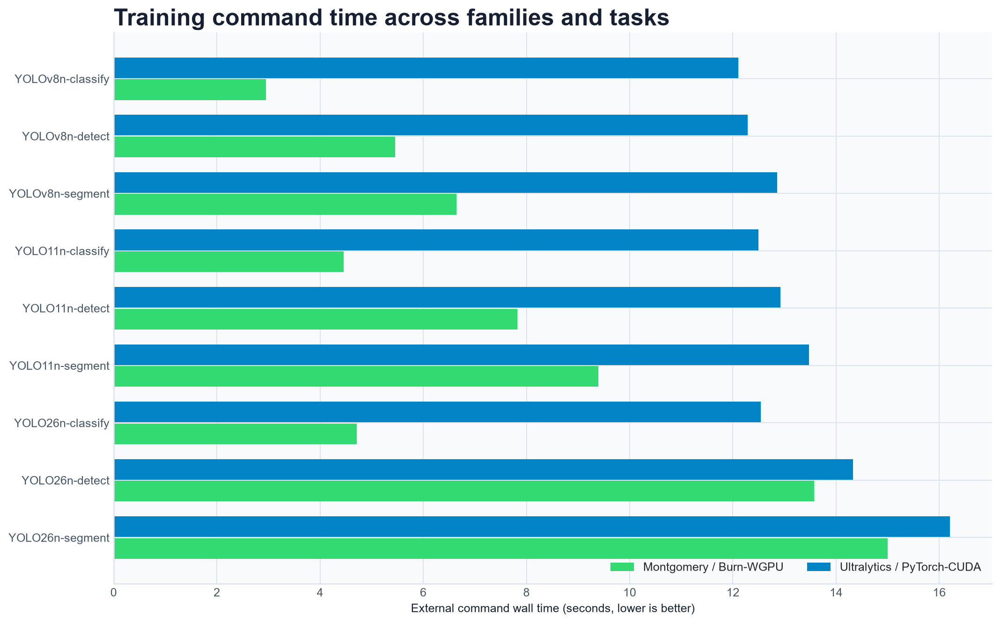

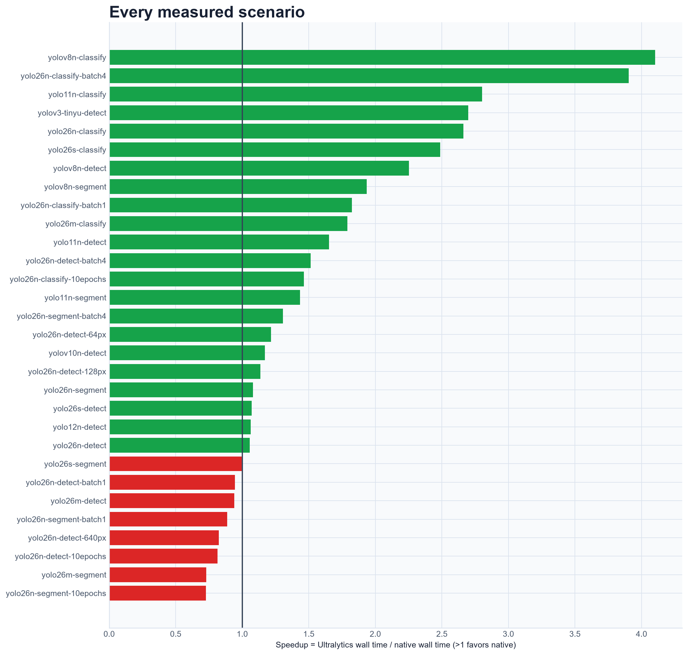

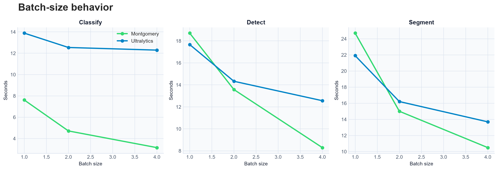

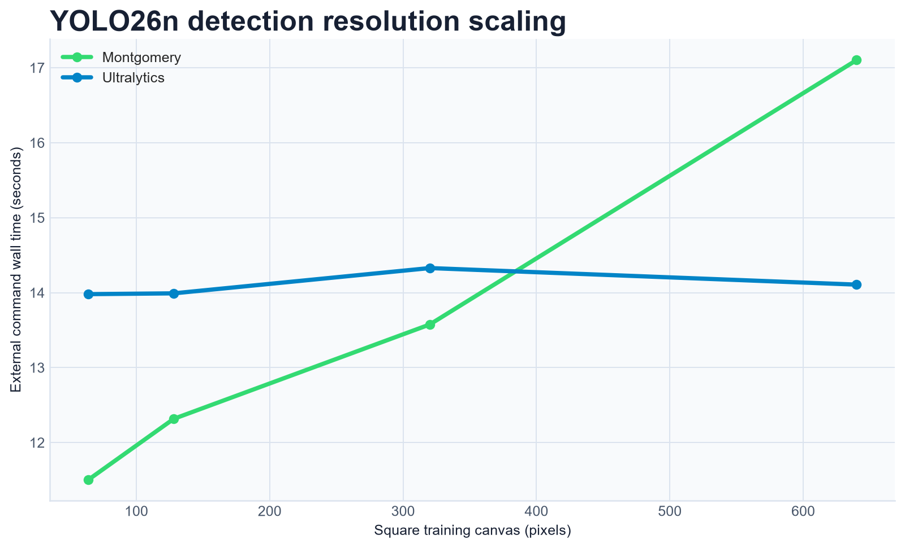

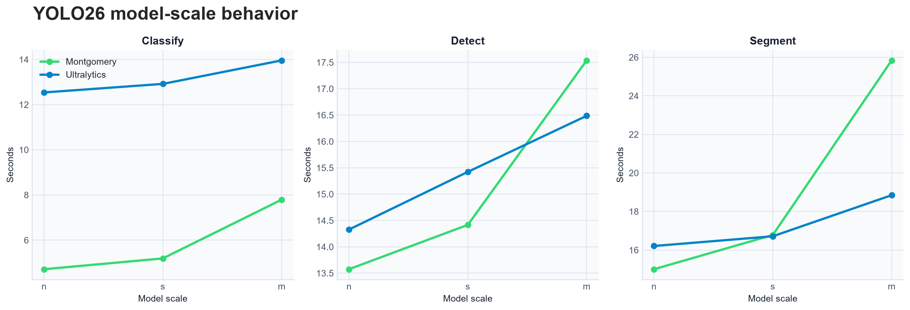

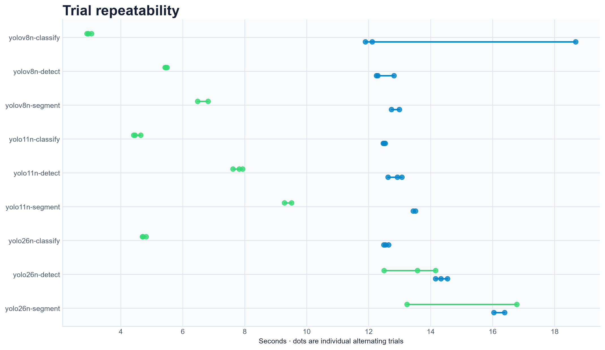

### No-LTO control

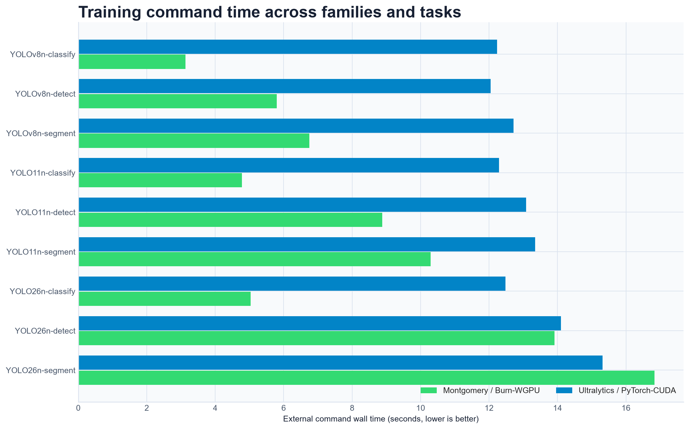

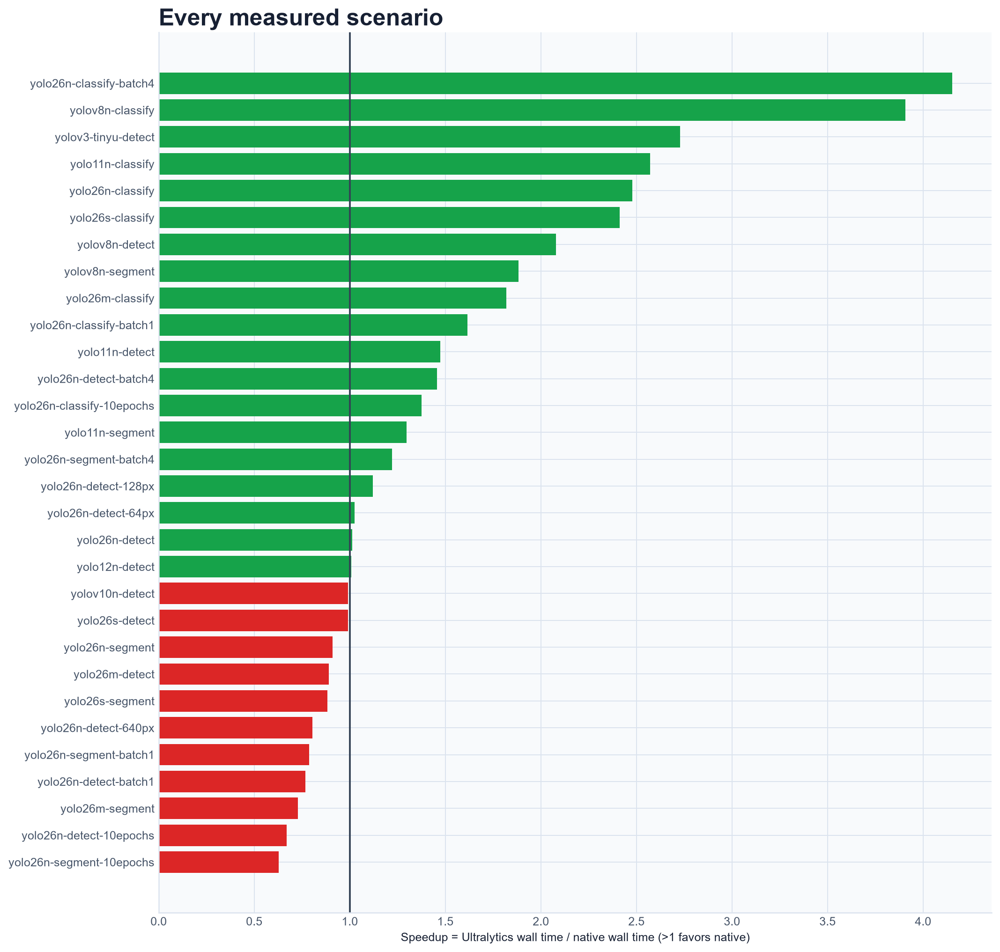

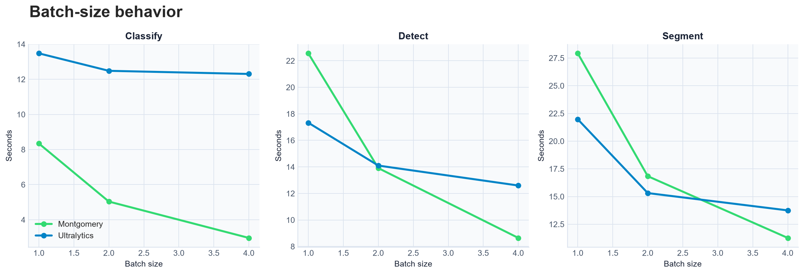

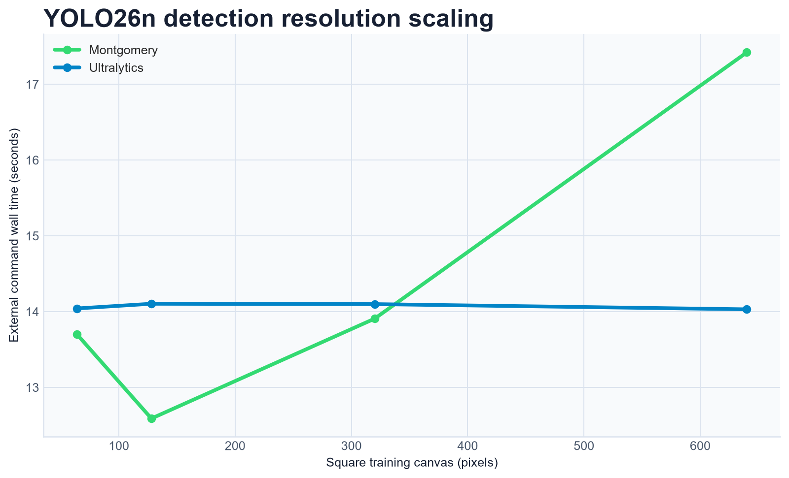

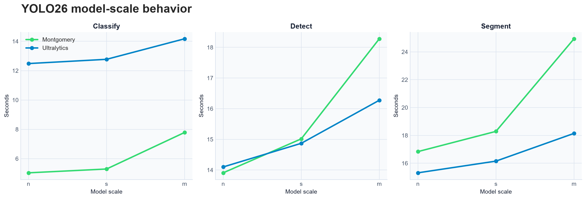

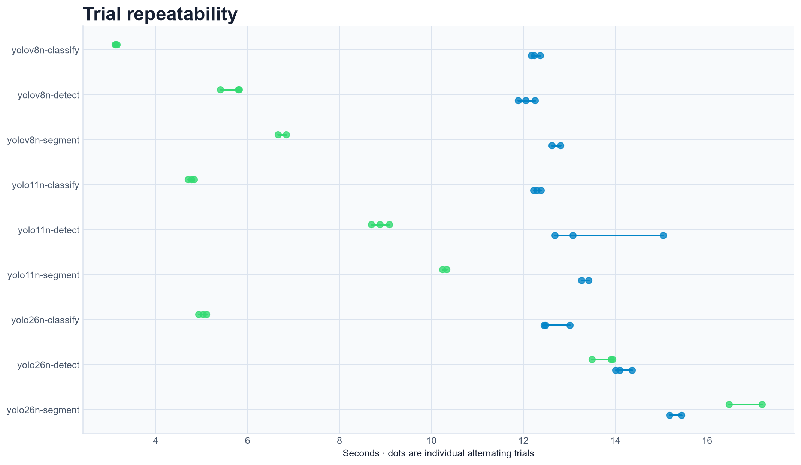

The remaining generated plots are retained beside each chart set: effective throughput,
first-versus-warm behavior, task speedup heatmap, and normalized convergence curves.

## All 30 native comparisons

Negative changes favor fat LTO. The normalized column compares each native/Ultralytics ratio with
the corresponding ratio from the other build session.

| Scenario | No LTO | Fat LTO | Raw change | Normalized change |
| --- | ---: | ---: | ---: | ---: |
| YOLOv8n classify | 3.131 s | 2.952 s | **-5.7%** | **-4.7%** |
| YOLOv8n detect | 5.794 s | 5.458 s | **-5.8%** | **-7.7%** |
| YOLOv8n segment | 6.752 s | 6.644 s | -1.6% | -2.7% |
| YOLO11n classify | 4.781 s | 4.459 s | **-6.7%** | **-8.2%** |
| YOLO11n detect | 8.882 s | 7.822 s | **-11.9%** | **-10.8%** |
| YOLO11n segment | 10.289 s | 9.392 s | **-8.7%** | **-9.6%** |
| YOLO26n classify | 5.035 s | 4.713 s | **-6.4%** | **-6.8%** |
| YOLO26n detect | 13.907 s | 13.575 s | -2.4% | **-3.9%** |
| YOLO26n segment | 16.836 s | 15.003 s | **-10.9%** | **-15.8%** |
| YOLOv3-Tiny-U detect | 4.378 s | 4.435 s | +1.3% | +1.1% |
| YOLOv10n detect | 13.732 s | 11.949 s | **-13.0%** | **-15.3%** |
| YOLO12n detect | 13.425 s | 13.165 s | -1.9% | **-5.2%** |
| YOLO26s classify | 5.294 s | 5.192 s | -1.9% | **-3.0%** |
| YOLO26s detect | 15.015 s | 14.416 s | **-4.0%** | **-7.4%** |
| YOLO26s segment | 18.289 s | 16.778 s | **-8.3%** | **-11.3%** |
| YOLO26m classify | 7.786 s | 7.793 s | +0.1% | +1.6% |
| YOLO26m detect | 18.280 s | 17.539 s | **-4.1%** | **-5.3%** |
| YOLO26m segment | 24.940 s | 25.840 s | **+3.6%** | -0.2% |
| YOLO26n classify, batch 1 | 8.342 s | 7.618 s | **-8.7%** | **-11.4%** |
| YOLO26n classify, batch 4 | 2.964 s | 3.148 s | **+6.2%** | **+6.3%** |
| YOLO26n detect, batch 1 | 22.559 s | 18.708 s | **-17.1%** | **-18.7%** |
| YOLO26n detect, batch 4 | 8.644 s | 8.294 s | **-4.1%** | **-3.8%** |
| YOLO26n segment, batch 1 | 27.922 s | 24.703 s | **-11.5%** | **-11.3%** |
| YOLO26n segment, batch 4 | 11.264 s | 10.492 s | **-6.9%** | **-6.5%** |
| YOLO26n detect, 64 px | 13.700 s | 11.503 s | **-16.0%** | **-15.7%** |
| YOLO26n detect, 128 px | 12.589 s | 12.316 s | -2.2% | -1.4% |
| YOLO26n detect, 640 px | 17.421 s | 17.102 s | -1.8% | -2.4% |
| YOLO26n classify, 10 epochs | 16.231 s | 15.258 s | **-6.0%** | **-5.8%** |
| YOLO26n detect, 10 epochs | 42.869 s | 35.338 s | **-17.6%** | **-17.8%** |
| YOLO26n segment, 10 epochs | 51.262 s | 44.791 s | **-12.6%** | **-13.5%** |

## Interpretation

Fat LTO is a net win for this release training binary. It improves most scenario medians, produces
the clearest gains in longer or host-heavy detect/segment runs, and makes the executable 8,849,408
bytes (8.44 MiB) smaller. YOLO26n classification at batch 4 is the only material regression that
survives control normalization.

The cost is build time. Enabling fat LTO invalidates release dependency code generation and makes
the final link substantially slower. The no-LTO control build completed incrementally in 3 minutes
5 seconds; the fat-LTO build was not a comparable warm-cache build, so this report does not assign a
formal build-time ratio.

## Methodology and raw data

- Hardware: NVIDIA GeForce RTX 5080, Burn/WGPU Vulkan backend.
- Source revision: `9d415df6a7e8fafe2dcbc045de0938b066537783` for both binaries.
- Timing: external complete-command wall time, excluding validation.
- Sampling: three trials normally and two for segmentation cells, with native WGPU priming outside
  the measured trials and alternating native/Ultralytics order.
- No-LTO executable SHA-256:
  `d8607318103a42f5966fecdd7af5d2c148d06e315b7747fe375472a7cf9a4a21`.
- Fat-LTO executable SHA-256:
  `5df2bb99cc3426604445593fb2dc46c46713419614dec825405f19ab9c75078e`.

The complete commands, individual trials, environment metadata, loss curves, and validation output
are preserved in the [no-LTO raw results](assets/lto-comparison/no-lto-results.json) and
[fat-LTO raw results](assets/lto-comparison/fat-lto-results.json).
