# Native training performance

boquilens native training is competitive today, but not uniformly faster. On the tested RTX 5080,
it wins all **12 smallest-variant family/task comparisons**, including every tested classification model and
the detection-only YOLOv3-Tiny-U, YOLOv10n, and YOLO12n models. YOLOv8n segmentation is **1.86×
faster** than Ultralytics; YOLO26n detection and segmentation are now just ahead at batch 2.

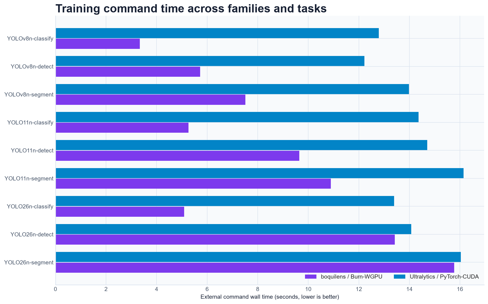

## At a glance

These are medians of complete training commands. A speedup above `1.00×` favors boquilens.

| Model | Task | boquilens | Ultralytics | Native speedup |
| --- | --- | ---: | ---: | ---: |
| YOLOv8n | Classify | 3.34 s | 12.79 s | **3.83×** |
| YOLOv8n | Detect | 5.73 s | 12.22 s | **2.13×** |
| YOLOv8n | Segment | 7.52 s | 13.98 s | **1.86×** |
| YOLO11n | Classify | 5.27 s | 14.36 s | **2.73×** |
| YOLO11n | Detect | 9.65 s | 14.71 s | **1.52×** |
| YOLO11n | Segment | 10.89 s | 16.15 s | **1.48×** |
| YOLO26n | Classify | 5.09 s | 13.40 s | **2.63×** |
| YOLO26n | Detect | 13.42 s | 14.07 s | **1.05×** |
| YOLO26n | Segment | 15.77 s | 16.03 s | **1.02×** |

The detect-only families use the same dataset and settings:

| Model | boquilens | Ultralytics | Native speedup |
| --- | ---: | ---: | ---: |
| YOLOv3-Tiny-U | 4.52 s | 11.87 s | **2.63×** |
| YOLOv10n | 11.49 s | 13.92 s | **1.21×** |
| YOLO12n | 12.09 s | 14.17 s | **1.17×** |

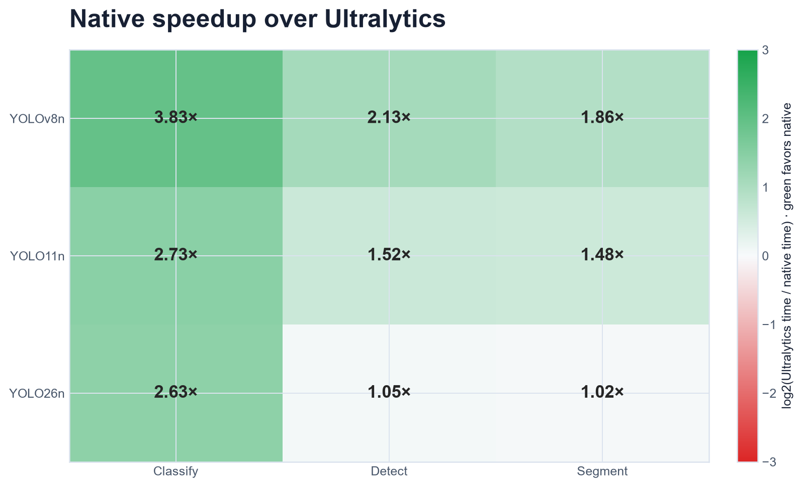

## Segmentation optimization

The original mask loss created a separate slice, matrix multiplication, BCE, and reduction graph
for every positive match. It now groups positives per image and evaluates one padded batched matrix
multiplication. The same change removes repeated prototype tensors. YOLO26's identical one-to-many
and detached one-to-one semantic targets are evaluated once.

Vectorizing the mask loss reduced the same 48-step YOLOv8n-seg command from **98.08 s to 9.64 s**.
The runtime and checkpoint work described below reduced the current full-command median again to
**7.52 s**, which is **1.86× faster** than Ultralytics' 13.98 s median.

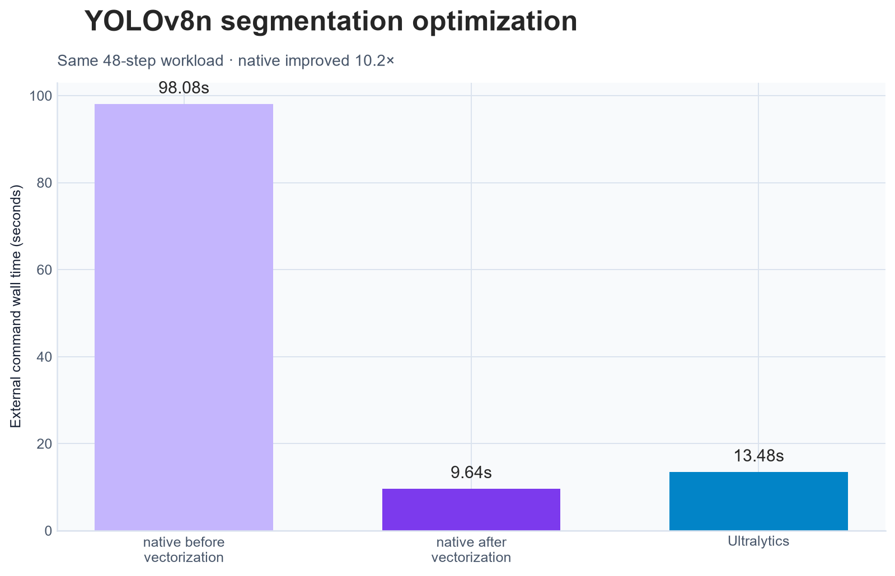

The correctness pass also aligned mask-crop lower bounds with Ultralytics and applied the shared
segmentation gain to the YOLO26 semantic term. Unit tests cover padded grouping, scalar loss parity,
backpropagation, semantic-value equality, and detached gradients.

## Runtime and checkpoint optimization

Burn/WGPU's grouped-convolution backward falls through a generic path. The light heads now use an
exact channelwise 3×3 stencil only while building an autodiff graph; normal inference and stored
parameters are unchanged. Forward values and weight gradients are tested against grouped
convolution. Together with flattened role-separated AdamW updates, this cut YOLO26n detection from
23.76 s to 13.42 s and YOLO11n segmentation from 17.38 s to 10.89 s.

Full resumable checkpoints still contain the model, EMA, and optimizer in FP32. Their independent
immutable snapshots are now downloaded and encoded concurrently instead of making three serial
GPU-to-host passes. AdamW moment tensors are stored as two flat parameter-role groups rather than
one record per tensor. Resume and step-for-step optimizer parity are tested.

## Scale comparison

YOLO26 classification stays ahead through medium. Detection wins at nano and small but is 13%
slower at medium. Segmentation remains the largest scale-dependent gap.

| Model | Task | boquilens | Ultralytics | Native speedup |
| --- | --- | ---: | ---: | ---: |
| YOLO26n | Classify | 5.09 s | 13.40 s | **2.63×** |
| YOLO26n | Detect | 13.42 s | 14.07 s | **1.05×** |
| YOLO26n | Segment | 15.77 s | 16.03 s | **1.02×** |
| YOLO26s | Classify | 4.94 s | 13.30 s | **2.69×** |
| YOLO26s | Detect | 12.95 s | 15.44 s | **1.19×** |
| YOLO26s | Segment | 19.54 s | 17.65 s | 0.90× |
| YOLO26m | Classify | 8.69 s | 14.89 s | **1.71×** |
| YOLO26m | Detect | 19.50 s | 17.22 s | 0.88× |
| YOLO26m | Segment | 25.91 s | 19.31 s | 0.75× |

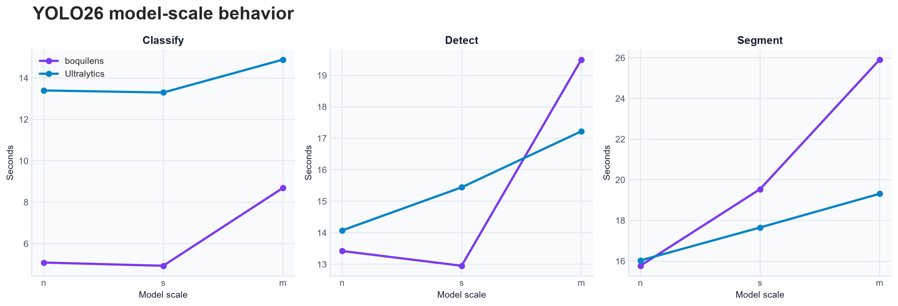

## Batch scaling

The batch sweep uses YOLO26n and changes only batch size. Native wins all three tasks at batch 4;
batch 1 exposes fixed WGPU dispatch and synchronization costs.

| Task | Batch | boquilens | Ultralytics | Native speedup |
| --- | ---: | ---: | ---: | ---: |
| Classify | 1 | 7.22 s | 14.32 s | **1.98×** |
| Classify | 2 | 5.09 s | 13.40 s | **2.63×** |
| Classify | 4 | 3.29 s | 13.11 s | **3.98×** |
| Detect | 1 | 24.14 s | 19.12 s | 0.79× |
| Detect | 2 | 13.42 s | 14.07 s | **1.05×** |
| Detect | 4 | 9.45 s | 13.61 s | **1.44×** |
| Segment | 1 | 29.09 s | 23.96 s | 0.82× |
| Segment | 2 | 15.77 s | 16.03 s | **1.02×** |
| Segment | 4 | 12.03 s | 14.92 s | **1.24×** |

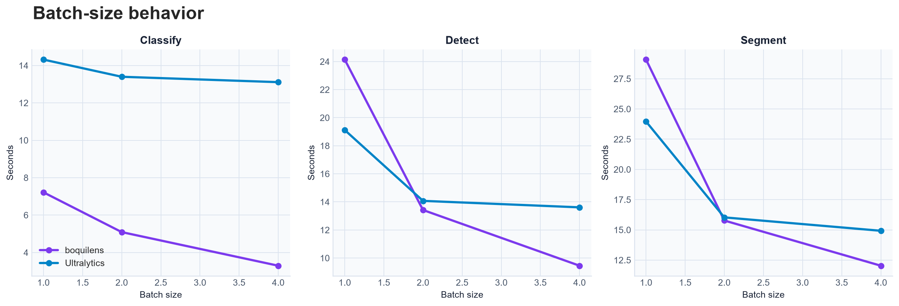

## Resolution scaling

This sweep uses YOLO26n detection, batch 2, and three epochs.

| Image size | boquilens | Ultralytics | Native speedup |
| ---: | ---: | ---: | ---: |
| 64 px | 14.89 s | 15.24 s | **1.02×** |
| 128 px | 14.38 s | 15.34 s | **1.07×** |
| 320 px | 13.42 s | 14.07 s | **1.05×** |
| 640 px | 18.84 s | 15.96 s | 0.85× |

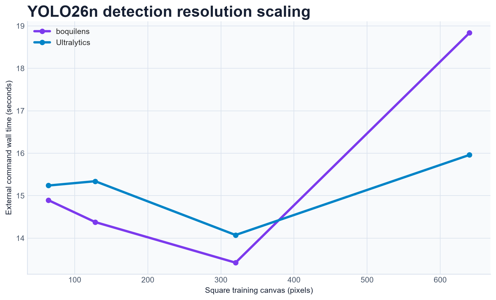

The near-flat Ultralytics results show that framework and process overhead dominate these deliberately
small jobs. Native wins through 320 px; 640 px still exposes backend work to do.

## Ten-epoch smoke runs

The longer runs exercise checkpointing, scheduling, loss reduction, and validation. They are still
too small to measure real model quality.

| Task | boquilens | Ultralytics | Native speedup |
| --- | ---: | ---: | ---: |
| Classify | 17.41 s | 24.17 s | **1.39×** |
| Detect | 40.75 s | 31.21 s | 0.77× |
| Segment | 53.26 s | 35.96 s | 0.68× |

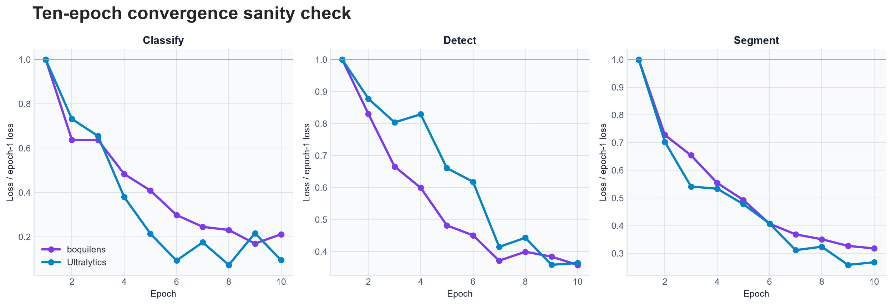

Loss magnitudes are normalized in the chart because the trainers report and reduce components
differently. Both losses stay finite and decrease, but this is a smoke signal rather than a claim of
equal optimization dynamics.

Post-training validation is outside the timed region:

| Task | boquilens | Ultralytics | Interpretation |
| --- | --- | --- | --- |
| Classify | top-1 41.7%, top-5 58.3% | top-1 41.7%, top-5 91.7% | 12 validation images; not quality evidence |
| Detect | mAP50 0.0, mAP50-95 0.0 | mAP50 0.0, mAP50-95 0.0 | 4 validation images; the run is too short |
| Segment | box/mask mAP 0.0 | box/mask mAP 0.0 | 4 validation images; the run is too short |

The benchmark proves that both implementations train, checkpoint, and validate the tested tasks. It
does **not** establish COCO or ImageNet convergence parity. That requires full datasets and standard
training schedules.

## All measured scenarios

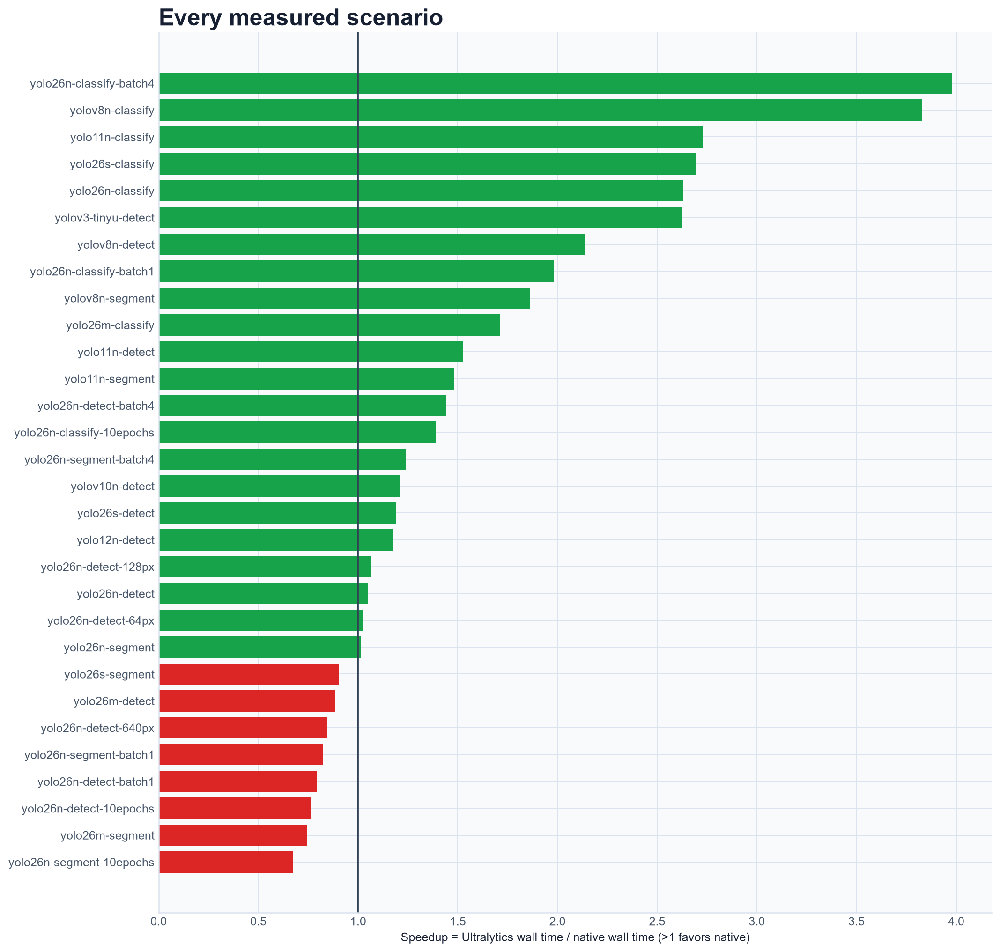

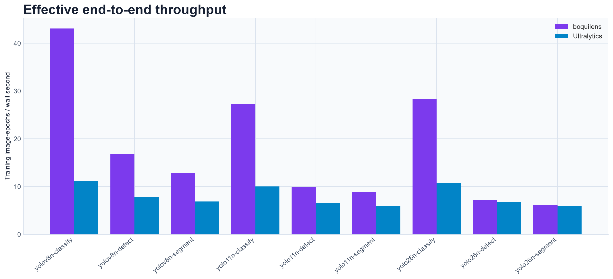

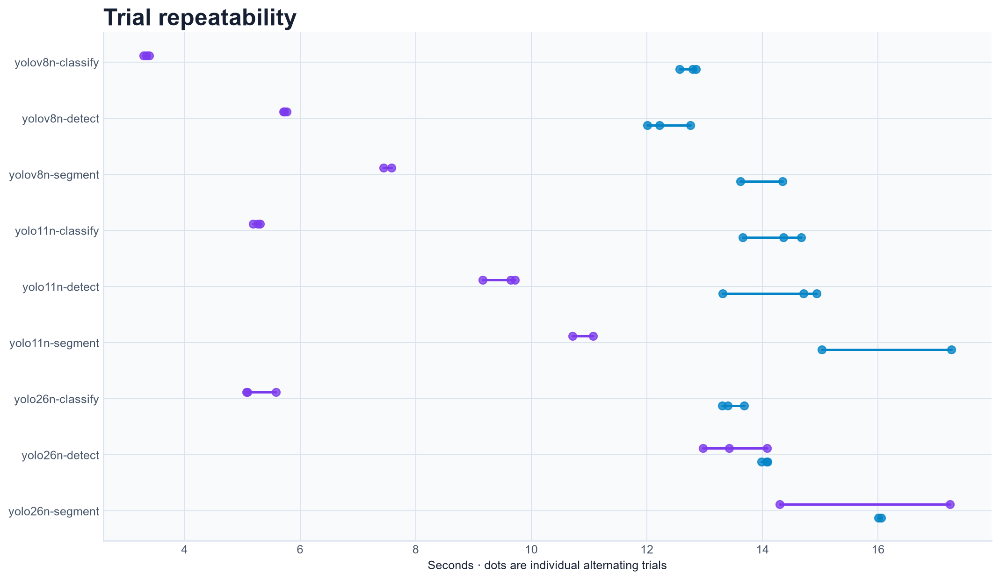

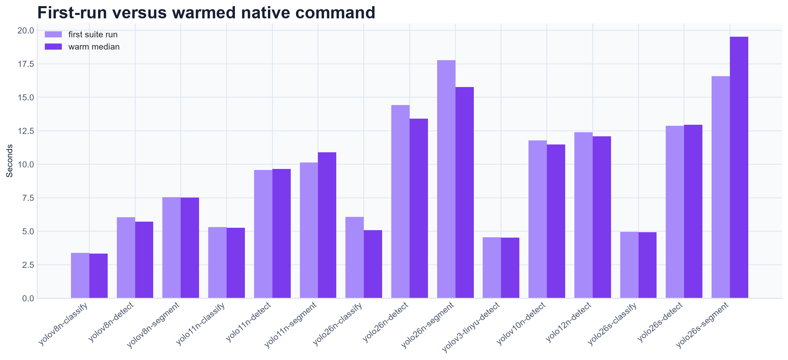

Per-trial values, medians, environment metadata, and captured commands are preserved in the
[raw benchmark results](assets/training-benchmark-results.json).

## Methodology

- Hardware: NVIDIA GeForce RTX 5080; native Burn/WGPU used Vulkan driver 610.47.
- Software: boquilens/Burn release build versus Ultralytics 8.4.117 and PyTorch 2.11 CUDA 13.0.
- Timing: external wall clock around the complete command, including startup, model loading,
  training, and checkpoint writes. Validation is excluded and recorded separately.
- Precision: FP32 for both implementations.
- Optimizer: AdamW, `lr0=0.001`, `lrf=0.05`, weight decay `0.0005`, momentum `0.9`, cosine decay,
  and no warmup. Nominal batch size equals actual batch size.
- Data loading: four workers; native prefetch depth two.
- Sampling: seed zero, alternating framework order, three trials normally and two for expensive
  segmentation cells.
- Inputs: the same real source fixtures, deterministically replicated with hard links. Classification
  uses 48 train/12 validation images; detection and segmentation use 32 train/4 validation images.
- Weights: the same upstream `.pt` checkpoint supplies both runs; native uses its tensor-only export.
- YOLOX is not in this matrix because Ultralytics does not provide a YOLOX training implementation;
  comparing it with the separate official YOLOX trainer would not be a 1:1 Ultralytics comparison.
- Warmup: native WGPU compilation is primed outside the measured trials. The first-vs-warm plot still
  exposes residual first-run effects.
- Augmentation policies and optimizer settings are matched where both APIs expose them. Random-number
  generators, scheduler details, and some loss reductions are not bit-identical.

This methodology emphasizes repeatable developer feedback and short-job latency. It is not
steady-state multi-hour throughput or a cross-framework quality leaderboard.

## Reproduce it

The complete comparison is one command after installing the pinned GPU benchmark environment and
preparing the upstream checkpoints:

```console
uv run --locked tools/benchmark_training.py --publish
```

It builds boquilens in release mode, prepares deterministic datasets, primes WGPU, runs the matrix,
validates the ten-epoch checkpoints, renders every chart, and publishes JSON and images under
`docs/assets/`.

For a quick iteration on one bottleneck:

```console
uv run --locked tools/benchmark_training.py --scenario yolov8n-segment --repeats 1 --segmentation-repeats 1
```

Use `--list` on `tools/bench_training_matrix.py` to see every scenario. Runs can be resumed, and full
checkpoints can be retained with `--keep-runs`; they are deleted by default to keep output small.

## What to optimize next

1. Reduce WGPU dispatch overhead for batch-1 and high-resolution YOLO26 workloads.
2. Reduce per-epoch full-precision record extraction cost in long runs.
3. Profile the remaining YOLO26 mask-head backward path at medium and larger scales.
4. Add full-dataset convergence runs before making quality-parity claims.
