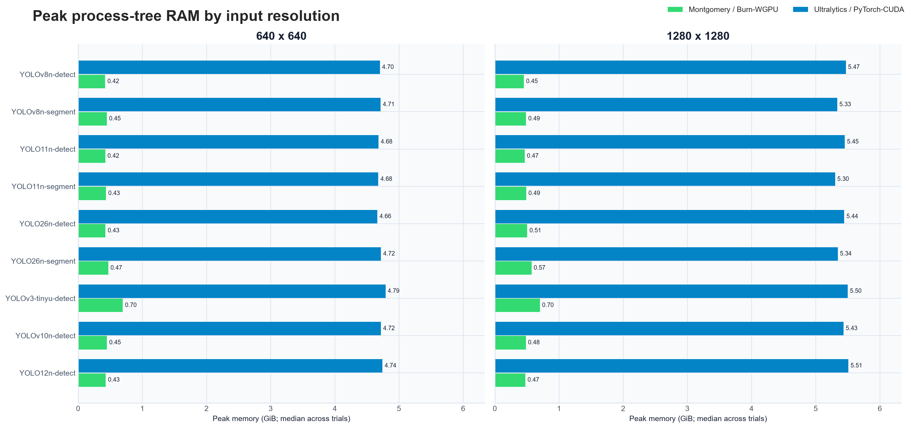
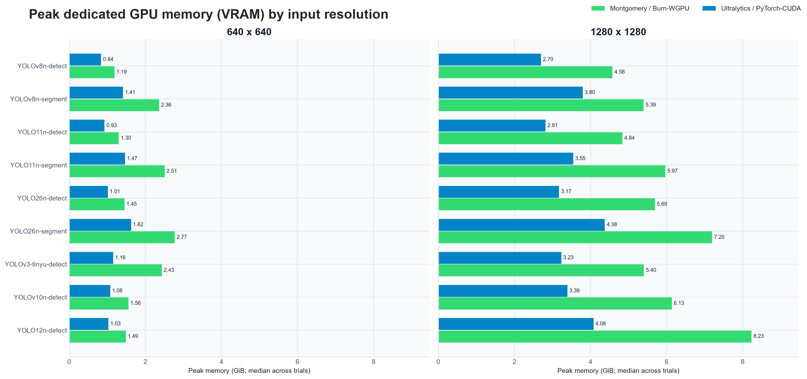

# Montgomery vs Ultralytics: training performance

This compares the complete training commands an end user runs: startup, data loading, three
epochs, and three resumable checkpoint writes. It is a speed and memory comparison, not an
accuracy comparison.

## Results at a glance

| Workload | Timing result | Montgomery RAM | Ultralytics RAM | VRAM result |
| --- | --- | ---: | ---: | --- |
| Classification, **224 × 224** | Montgomery is **2.36–3.41× faster** | 0.35–0.36 GiB | 5.97–6.03 GiB | Montgomery uses 0.17–0.18 GiB less |
| Vision, **640 × 640** | Montgomery wins all 9: **1.07–2.01× faster** | 0.42–0.70 GiB | 4.66–4.79 GiB | Ultralytics uses less in all 9 |
| Vision, **1280 × 1280** | Ultralytics wins 8 of 9: **1.07–1.61× faster** | 0.45–0.70 GiB | 5.30–5.51 GiB | Ultralytics uses less in all 9 |

At 1280, YOLOv8n detection is effectively tied: Montgomery is 1.03× faster. The main tradeoff is
clear: Montgomery uses dramatically less host RAM, but more VRAM for vision training.


## Exact workload

| Setting | Both programs |
| --- | --- |
| GPU | NVIDIA GeForce RTX 5080, 16 GB |
| Vision data | 32 images |
| Vision image sizes | **640 × 640** and **1280 × 1280** |
| Classification data | 48 images at **224 × 224** |
| Training | 3 epochs, batch 2, seed 0 |
| Math and optimizer | Strict FP32, AdamW |
| Loader request | `--workers 4` |
| Validation and export | Disabled |
| Checkpoints | One full resumable checkpoint per epoch |
| Reported time | External wall-clock median of 3 runs; segmentation uses 2 |

Montgomery is the current Burn `0.22.0-pre.3` implementation using WGPU/Vulkan. Ultralytics is
8.4.117 using PyTorch 2.11/CUDA. Each gets an untimed warm-up run, and timed order alternates.
Lower time, RAM, and VRAM numbers are better.

## 640 × 640 vision results

Every row below is exactly 32 images, 3 epochs, batch 2, and 4 requested workers.

| Model / task | Time: M / U | Faster | RAM: M / U | VRAM: M / U |
| --- | ---: | ---: | ---: | ---: |
| YOLOv8n detect | 6.88 / 13.81 s | **M 2.01×** | 0.42 / 4.70 GiB | 1.19 / 0.84 GiB |
| YOLOv8n segment | 9.35 / 14.94 s | **M 1.60×** | 0.45 / 4.71 GiB | 2.36 / 1.41 GiB |
| YOLO11n detect | 8.68 / 13.53 s | **M 1.56×** | 0.42 / 4.68 GiB | 1.30 / 0.93 GiB |
| YOLO11n segment | 11.36 / 14.92 s | **M 1.31×** | 0.43 / 4.68 GiB | 2.51 / 1.47 GiB |
| YOLO26n detect | 11.46 / 14.57 s | **M 1.27×** | 0.43 / 4.66 GiB | 1.45 / 1.01 GiB |
| YOLO26n segment | 16.13 / 17.33 s | **M 1.07×** | 0.47 / 4.72 GiB | 2.77 / 1.62 GiB |
| YOLOv3-Tiny-U detect | 6.37 / 12.02 s | **M 1.89×** | 0.70 / 4.79 GiB | 2.43 / 1.16 GiB |
| YOLOv10n detect | 11.46 / 16.80 s | **M 1.47×** | 0.45 / 4.72 GiB | 1.56 / 1.08 GiB |
| YOLO12n detect | 12.30 / 17.24 s | **M 1.40×** | 0.43 / 4.74 GiB | 1.49 / 1.03 GiB |

`M / U` means Montgomery / Ultralytics. The bold `Faster` cell identifies the timing winner.

## 1280 × 1280 vision results

Only image size changes. Doubling each edge makes the image canvas four times larger.

| Model / task | Time: M / U | Faster | RAM: M / U | VRAM: M / U |
| --- | ---: | ---: | ---: | ---: |
| YOLOv8n detect | 14.49 / 14.87 s | **M 1.03×** | 0.45 / 5.47 GiB | 4.58 / 2.70 GiB |
| YOLOv8n segment | 20.18 / 15.10 s | **U 1.34×** | 0.49 / 5.33 GiB | 5.39 / 3.80 GiB |
| YOLO11n detect | 16.36 / 15.29 s | **U 1.07×** | 0.47 / 5.45 GiB | 4.84 / 2.81 GiB |
| YOLO11n segment | 21.64 / 15.31 s | **U 1.41×** | 0.49 / 5.30 GiB | 5.97 / 3.55 GiB |
| YOLO26n detect | 18.94 / 17.43 s | **U 1.09×** | 0.51 / 5.44 GiB | 5.69 / 3.17 GiB |
| YOLO26n segment | 28.16 / 17.50 s | **U 1.61×** | 0.57 / 5.34 GiB | 7.20 / 4.38 GiB |
| YOLOv3-Tiny-U detect | 19.17 / 14.08 s | **U 1.36×** | 0.70 / 5.50 GiB | 5.40 / 3.23 GiB |
| YOLOv10n detect | 20.64 / 16.56 s | **U 1.25×** | 0.48 / 5.43 GiB | 6.13 / 3.39 GiB |
| YOLO12n detect | 21.11 / 16.61 s | **U 1.27×** | 0.47 / 5.51 GiB | 8.23 / 4.08 GiB |

## 224 × 224 classification results

| Model | Time: M / U | Faster | RAM: M / U | VRAM: M / U |
| --- | ---: | ---: | ---: | ---: |
| YOLOv8n-cls | 3.74 / 12.73 s | **M 3.41×** | 0.35 / 5.97 GiB | 0.26 / 0.44 GiB |
| YOLO11n-cls | 5.43 / 12.80 s | **M 2.36×** | 0.36 / 6.03 GiB | 0.27 / 0.44 GiB |
| YOLO26n-cls | 5.33 / 12.70 s | **M 2.38×** | 0.35 / 6.03 GiB | 0.27 / 0.44 GiB |

These tiny jobs measure developer-feedback cost, including process startup and checkpointing. They
do not represent long-run throughput.

## Memory measurement

RAM and VRAM come from a separate observed run for each row, sampled every 100 ms. RAM is peak
resident memory for the training process and all descendants. VRAM is their peak dedicated GPU
memory, not whole-device usage.





The observer adds no overhead to the reported times: it is disabled for all timed trials and runs
only during the separate memory pass. No monitoring code or thread was added to Montgomery.

## Is this apples to apples?

Yes at the user-visible workload level: same model family and upstream parameters, task, data,
resolution, epochs, batch, seed, strict FP32, AdamW settings, requested workers, validation policy,
and checkpoint cadence. Montgomery reads converted Burnpacks; Ultralytics reads the original
PyTorch checkpoints.

The implementations remain intentionally different:

| `--workers 4` maps to | Montgomery | Ultralytics |
| --- | --- | --- |
| Workers | 4 threads | 4 PyTorch processes |
| Prefetch | One global queue of 2 batches | Per-worker queues, up to 16 tasks total |
| GPU path | Burn/WGPU/Vulkan | PyTorch/CUDA with pinned host memory |

Those internals are part of each product's real operational cost. The Ultralytics wrapper disables
its forced final validation and checkpoint stripping so both commands do the same work and retain
resumable optimizer/model state.

## Trial repeatability

Each of the nine baseline family/task workloads occupies one aligned row on one shared time axis.
Circles are individual trials, diamonds are medians, thick lines are min–max ranges, and thin lines
connect framework medians.


## Raw data and reproduction

The [schema-v5 raw results](assets/training-benchmark-results.json) contain every command, timed
trial, memory sample summary, software version, and failure. One YOLO26n-segment 1280 Montgomery
attempt stopped on a transient non-finite box; the exact resumed retry and both reported trials
completed, and the failed attempt remains recorded for transparency.

Run and publish the same 21 scenarios:

```console
uv run --project tools tools/benchmark_training.py --docs-matrix --publish
```

Run one model at both vision resolutions:

```console
uv run --project tools tools/benchmark_training.py \
  --scenario yolov8n-detect \
  --scenario yolov8n-detect-1280px \
  --repeats 1
```
